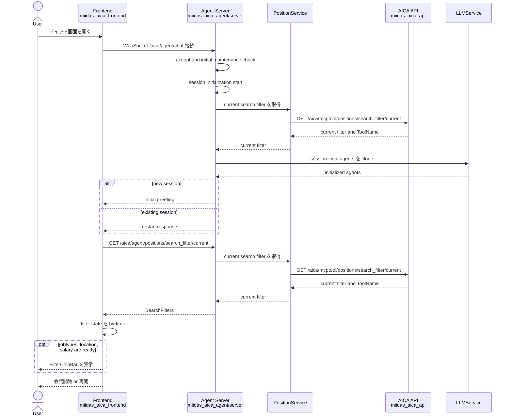
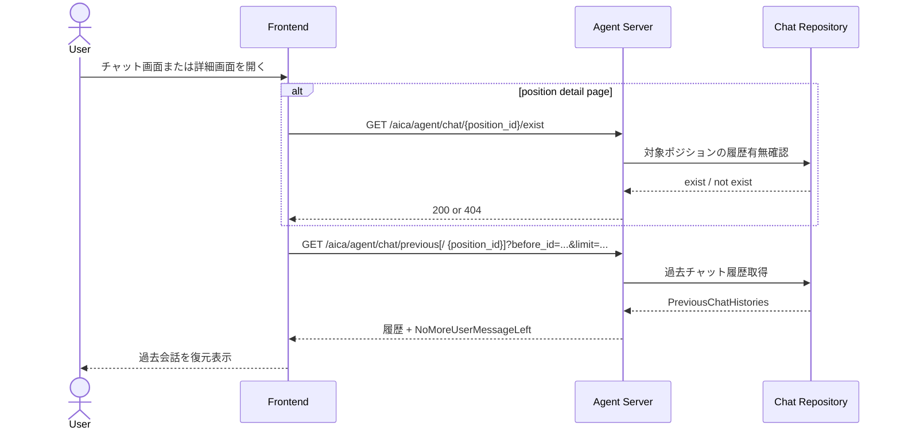
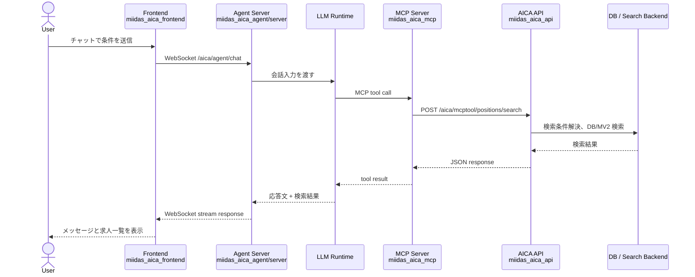
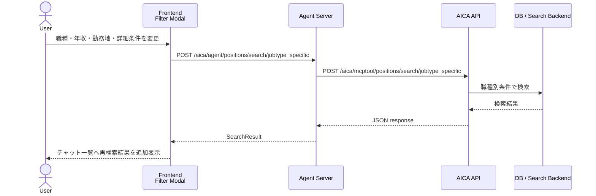
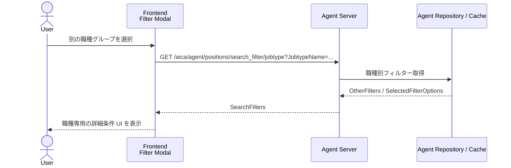
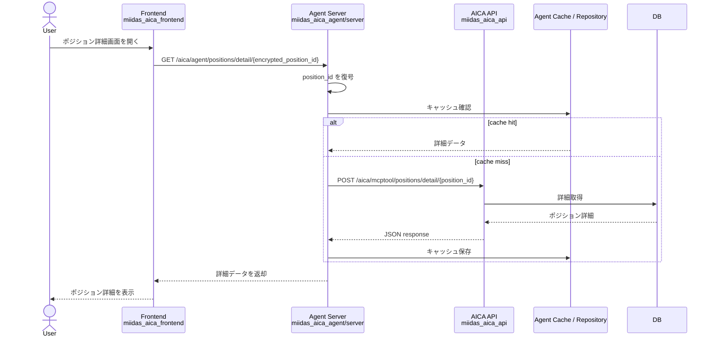
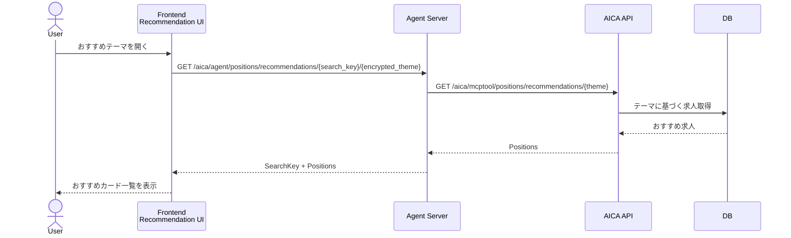
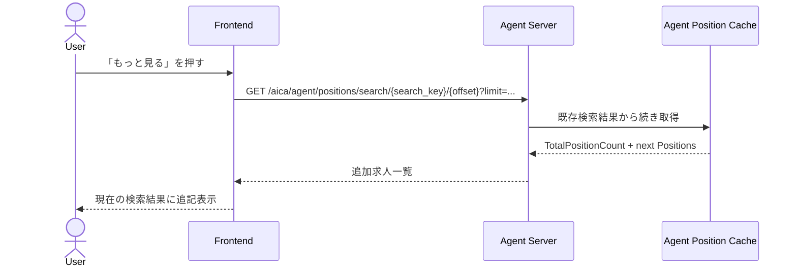
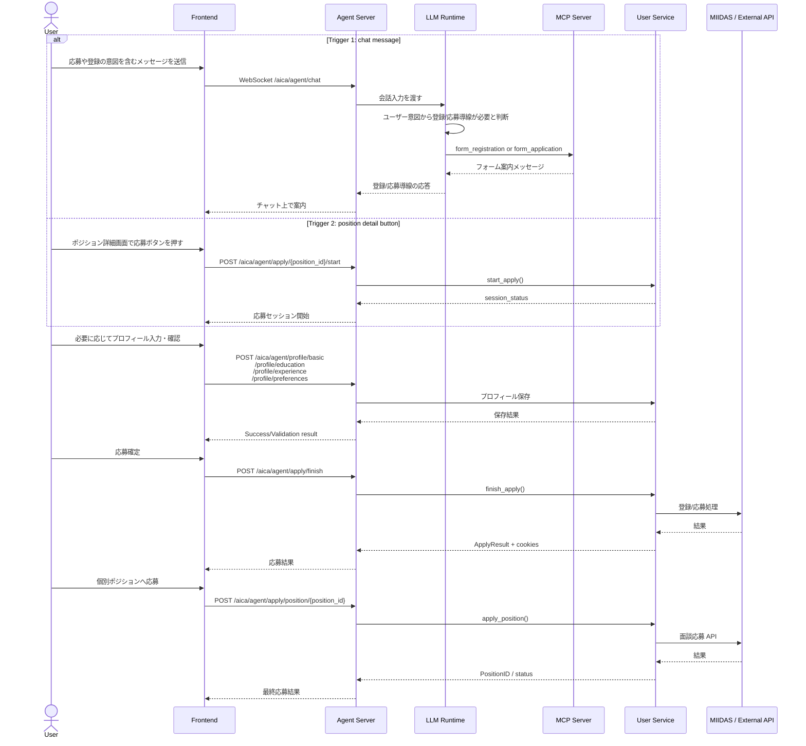
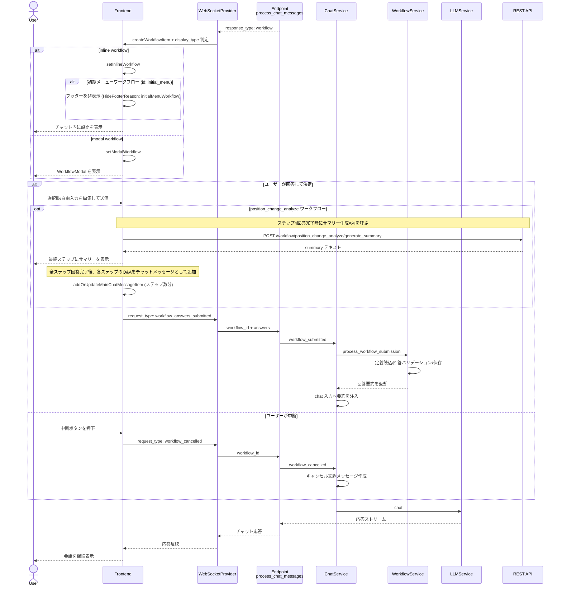

# AICA Workspace

このワークスペースは、AI転職アドバイザーを構成する複数プロジェクトをまとめて開発するためのルートです。

利用者向けの主要な実行経路は次のとおりです。

1. `miidas_aica_frontend`
   Next.js フロントエンド。ユーザーのチャット UI とポジション詳細画面を提供します。
2. `miidas_aica_agent/server`
   FastAPI ベースの Agent サーバー。WebSocket `/chat` と REST API を提供し、LLM と MCP を仲介します。
3. `miidas_aica_mcp`
   Go 製 MCP サーバー。Agent からのツール呼び出しを受け、AICA API に委譲します。
4. `miidas_aica_api`
   Go 製 API サーバー。ポジション検索、詳細取得、職種/業種/勤務地関連 API を提供します。

補助プロジェクト:

- `miidas_aica_agent/cli`
  バッチ、マイグレーション、メンテナンス系処理。
- `miidas_aica_agent/e2e`
  Agent サーバーとの E2E 検証クライアント。

## Project Map

| Project | Role | Main Tech | Main Entry | Default Port |
| --- | --- | --- | --- | --- |
| `miidas_aica_frontend` | チャット UI、ポジション詳細 UI | Next.js / React / TypeScript | `start_frontend.sh` | `80` |
| `miidas_aica_agent/server` | WebSocket と REST API、LLM 実行 | FastAPI / Python | `start_server.sh` | `8000` |
| `miidas_aica_mcp` | MCP ツール公開、API への橋渡し | Go / `mcp-go` | `start_server.sh` | `8080` |
| `miidas_aica_api` | 業務 API、検索/詳細/マスター取得 | Go | `start_server.sh` | `10001` |
| `miidas_aica_agent/cli` | バッチ、DB メンテ | Python | `cli` 配下スクリプト | - |
| `miidas_aica_agent/e2e` | E2E テストクライアント | Python | `start_test.sh` | - |

## Runtime Relation

- Frontend は `NEXT_PUBLIC_AGENT_ENDPOINT` で Agent の WebSocket `/aica/agent/chat` に接続します。
- Frontend は `NEXT_PUBLIC_API_ENDPOINT` で Agent の REST API `/aica/agent/...` を利用します。
- Agent は `AICA_AGENT_MCP_ENDPOINT` で MCP の `/sse` に接続します。
- Agent は `AICA_AGENT_API_ENDPOINT` で AICA API の `/aica/mcptool/...` を直接利用します。
- MCP は `AICA_MCP_API_SERVER` を使って AICA API を呼び出します。
- API/Agent/MCP はいずれも DB や周辺基盤に依存します。

## Startup Order

ルートの `start.sh` は次の順で起動します。

1. `miidas_aica_api`
2. `miidas_aica_mcp`
3. `miidas_aica_agent/server`
4. `miidas_aica_frontend`

この順序になっているのは、Agent が MCP と API を利用し、Frontend が Agent を利用するためです。

## Sequence Diagram

このワークスペースでは、UI から見た主要フローは 1 つではありません。  
特に `miidas_aica_frontend` は WebSocket と REST API を使い分けており、画面操作ごとに経路が変わります。

### 1. セッション初期化

既存セッションの再開時に走る過去会話復元は、[2. 画面初期化時の過去会話復元](#2-画面初期化時の過去会話復元) を参照してください。  
また、フロントエンドはチャット画面初期化時に現在の求人検索フィルターを取得し、条件が揃っていれば `FilterChipBar` を表示します。`JobSearchFilterDialog` のモーダル本体は、そのバーをクリックしたときに開きます。



### 2. 画面初期化時の過去会話復元

チャット画面やポジション詳細画面では、画面表示時に過去会話の有無確認と履歴取得が走ります。



### 3. チャット経由のポジション検索



### 4. フィルターモーダルからの職種別再検索

`JobSearchFilterModal` では、チャットで一度得た検索条件を UI 上で再編集し、`jobtype_specific` REST API を直接叩いて再検索する経路があります。



### 5. 職種切り替え時の詳細フィルター取得

職種グループを切り替えると、その職種専用の `OtherFilters` を取得して UI を組み替えます。



### 6. ポジション詳細画面の取得



### 7. おすすめポジションの取得

検索結果カード配下の recommendation UI は、Agent REST API を経由しておすすめ一覧を取得します。



### 8. 検索結果の「もっと見る」

初回検索結果の続きを取得するときは、Frontend が Agent の REST API を呼び、Agent が保存済み検索結果を元にページングします。



### 9. 応募開始から応募確定まで

応募・登録導線には少なくとも 2 つのトリガーがあります。

- チャット上でユーザーが「登録したい」「応募したい」と伝え、LLM が MCP の `form_registration` / `form_application` ツールを呼ぶ
- ポジション詳細画面でユーザーが応募ボタンを押す

下記は、その 2 つのトリガーと、その後の応募確定フローをまとめたものです。



### 10. Workflow の提示・回答・中断

`workflow.md` のフローを、Frontend から Agent までのメッセージ往復に寄せてシーケンス化したものです。



## Project-Level Processing Docs

各プロジェクト内部の詳細フローは、それぞれの README に移しました。  
ルート README では全体構造とプロジェクト間シーケンスを見て、個別処理は以下を参照してください。

- [miidas_aica_frontend/README.md](https://github.com/MIIDAS-Company/miidas_aica_frontend/blob/develop/README.md)
  チャット画面初期化、WebSocket ストリーム、検索フィルター復元、REST ベース画面処理のフローをまとめています。
- [miidas_aica_agent/server/README.md](https://github.com/MIIDAS-Company/miidas_aica_agent/blob/master/server/README.md)
  WebSocket セッション初期化、メッセージ処理ループ、職種選択時の動的ツール差し替え、REST API 委譲をまとめています。
- [miidas_aica_mcp/README.md](https://github.com/MIIDAS-Company/miidas_aica_mcp/blob/develop/README.md)
  MCP サーバー起動、ツール定義ロードと登録、各 tool handler から AICA API へ委譲する流れをまとめています。
- [miidas_aica_api/README.md](https://github.com/MIIDAS-Company/miidas_aica_api/blob/develop/README.md)
  既存の `ポジションAPI エンドポイントフロー` を中心に、handler から usecase までの詳細処理をまとめています。

### Supporting Projects

- `miidas_aica_agent/cli`
  Flyway マイグレーション、会話データ整理、レート制限集計などの運用処理を担当します。
- `miidas_aica_agent/e2e`
  WebSocket ベースで Agent サーバーの会話フローを検証するクライアントです。

## Repository Notes

- `miidas_aica_frontend`
  UI 層。会話とフィルター状態は Redux で管理します。
- `miidas_aica_agent/server`
  WebSocket 会話、REST API、MCP 接続、OpenAI Agents 初期化を担当します。
- `miidas_aica_mcp`
  各ツール実装は `src/sdk/tools` 配下にあり、AICA API に HTTP リクエストします。
- `miidas_aica_api`
  `src/api/mcptool/http` 配下で各 API ルートを公開し、usecase/repository 層へつなぎます。
- `miidas_aica_agent/cli`
  マイグレーションや会話データ整理などの運用系コマンドを持ちます。
- `miidas_aica_agent/e2e`
  WebSocket ベースで Agent サーバーを検証します。

## Local Start

個別起動:

```bash
cd miidas_aica_api && ./start_server.sh
cd miidas_aica_mcp && ./start_server.sh
cd miidas_aica_agent/server && ./start_server.sh
cd miidas_aica_frontend && ./start_frontend.sh
```

まとめて起動:

```bash
./start.sh
```

## GOバージョンアップツール

upgrade-go-version.sh

### 使い方

`~/aica/`配下にコピーしてから
```bash
cd ~/aica
chmod +x upgrade-go-version.sh
./upgrade-go-version.sh x.x.x
```
