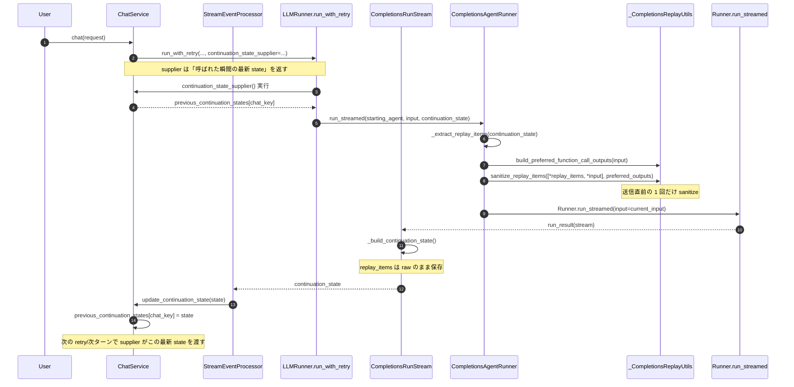
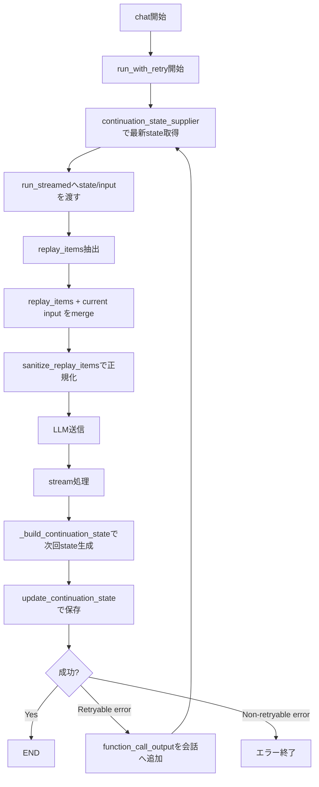

# 概要

下記３つのプロジェクトが入っています。

- エージェントサーバー
  - server
- バッチ
  - cli
- E2Eクライアント
  - e2e

# 開発者向け

## プロジェクト共通

### 開発言語とバージョン

- Agent/Server, CLI, E2E: Python 3.14 (>=3.14,<3.15)
  - VS Code 仮想環境: `.venv-server`（Server）、`.venv-cli`（CLI）、`.venv-e2e`（E2E）
  - macOS でのインストール例: `brew install python@3.14`

#### Pythonライブラリ

各プロジェクトの依存関係は2層で管理されています：

1. **pyproject.toml** - 直接利用するライブラリとそのバージョン範囲を定義
   - 例：`fastapi~=0.124.0` (0.124.xのパッチバージョンを許可)

2. **requirements.txt / requirements-dev.txt** - pip-toolsで生成されたロックファイル
   - 全ての依存関係（直接・間接）の正確なバージョンを固定
   - 本番環境とCI/CDで使用し、再現性のあるビルドを保証
   - `requirements.txt`: 本番用（テスト依存関係を含まない）
   - `requirements-dev.txt`: 開発用（テスト依存関係を含む）

##### 依存関係の更新方法

pyproject.tomlで依存関係を追加・更新した後、ロックファイルを再生成してください：

```bash
# プロジェクトルートから実行

# 全コンポーネント（server/cli/e2e）のロックファイルを更新
./update-requirements.sh

# 特定のコンポーネントのみ更新
./update-requirements.sh server
./update-requirements.sh cli
./update-requirements.sh e2e

# 依存関係を最新の互換バージョンにアップグレード
./update-requirements.sh --upgrade
./update-requirements.sh server --upgrade
```

注意：直接利用ライブラリが依頼するライブラリのマイナーバージョンアップによりアプリが動かなくなる場合があるため、`requirements.txt`で全ての依存関係のバージョンを固定しています。

### 設定ファイル
- pyproject.toml
  - Pythonプロジェクト設定
  - 依頼ライブラリ
    - 本来は直接利用ライブラリだけ記入して、必要なライブラリは全部自動的にインストールされますが、直接利用ライブラリが依頼するライブラリのマイナーバージョンアップより、アプリが動かなくなる場合があります。
    - そのため動く時に必要なライブラリとバージョンを全部正確に記入しています。
- config.yml
  - Logger、DBなどの設定
- .env.local
  - 環境変数

### コンテナを使わず、ローカルデバッグのための準備

#### Pythonインストール

`brew install python@3.14`
よりインストールできます。

#### ライブラリインストール（推奨手順）

```
# Server
python3.14 -m venv .venv-server
source .venv-server/bin/activate
pip install ./server[dev]

# E2E
python3.14 -m venv .venv-e2e
source .venv-e2e/bin/activate
pip install ./e2e

# CLI（必要に応じて）
python3.14 -m venv .venv-cli
source .venv-cli/bin/activate
pip install ./cli
```

#### VSCode Pluginインストール

- `Python`
- `Python Debugger`

#### `venv`作成

[Python environments in VS Code](https://code.visualstudio.com/docs/python/environments)参照していただきたいのですが、ステップは：

1. VSCodeで`Shift+Command+P`でコマンド入力欄
2. `Python: Create Environment`を検索
3. Environment typeでは`Venv`を選択
4. Interpreterでは`Python 3.14`を選択

##### 備考

- `venv`はローカルですでにインストールされたPythonを利用しますので、先にPythonをインストールしてください。
- 実行時に作られた`venv`を利用するため
  - VSCodeでpythonの`.py`ファイルを開きます（どのファイルでもOK）
  - VSCodeの右下のpyhonのバージョンが表示されます。**重要**：ここに`3.14(.venv-*)`と書いていなければグローバルのpythonを使っているので、必ず`(.venv-*)`が記載されていることを確認してください。もし`3.14`だけで`(.venv-*)`の記載がなければ、そのバージョン番号を押して`3.14(.venv-*)`を選択してください

#### VSCodeのデバッグ実行方法

1. VSCodeの左の三角ボタンを押すとデバッグモードに切り替わります
2. VSCodeの左上のドロップダウンに実行したいのを選択してください
3. ドロップダウンの左の三角ボタンを押して起動します

## プロジェクト毎

それぞれの`README.md`を参照してください。

## チャット実行時の continuation_state / replay_items 詳細フロー

`Completions` 経路で混乱しやすいのは、以下 3 点が別コンポーネントに分かれていることです。

1. `CompletionsRunStream._build_continuation_state()` が「次ターン用 state を生成」する
2. `ChatService` が `continuation_state_supplier` で「最新 state を次試行へ渡す」
3. `CompletionsAgentRunner.run_streamed()` が「最新 state から replay_items を取り出し、current input と merge して sanitize して送信」する

用語整理（ここが最重要）:

- `continuation_state`:
  - 次試行/次ターンへ渡す「継続用の箱」全体
  - 例: `run_state`, `agent_state`, `replay_items`, `usage` を含む
- `replay`:
  - 上記 `continuation_state` の中にある `replay_items` を指す略称
  - `replay` 自体は state 全体ではない

したがって、`replay + current input` の `replay` は
`continuation_state` そのものではなく、
`continuation_state` から抽出した `replay_items` を意味します。

要点:

- `_build_continuation_state()` は「保存用 state の生成側（producer）」
- `run_streamed(... sanitize_replay_items([...replay, ...input]))` は「state から replay_items を取り出した後、送信直前で正規化する側（consumer）」

### 1. 役割分担（責務マップ）

| 層 | 主要メソッド | 役割 |
|---|---|---|
| Stream wrapper | `CompletionsRunStream._build_continuation_state()` | 現在ターン結果から次ターン継続 state を構築・キャッシュ |
| Service orchestration | `ChatService` の `continuation_state_supplier` | retry/次試行で「その時点の最新 state」を遅延取得して runner に渡す |
| Runner input assembly | `CompletionsAgentRunner.run_streamed()` | `replay_items` と current input を結合し、送信直前で sanitize |
| Replay normalization | `_CompletionsReplayUtils.sanitize_replay_items()` | tool pair 整合・不要項目除去・必要な出力優先適用 |

### 2. 時系列シーケンス（1ターン完了から次ターン送信まで）



### 3. 分岐付きフロー（retry を含む）



### 4. 実装上の読み方（混乱しやすい点）

- `continuation_state` は「同一オブジェクトが流れ続ける」のではなく、各試行で保存・再取得される。
- `continuation_state_supplier` は固定値ではなく遅延評価なので、直前試行で更新された state を拾える。
- `_build_continuation_state()` の `replay_items` は「次ターンへ持ち越す素材」。
- 実際に LLM に送る直前の `current_input` でのみ sanitize する。

# DBマイグレーション
1. `AICA_MIGRATION_DIR`が`./server/.env.local`に設定されていることを確認（値はAICAのマイグレーションファイルが格納されているディレクトリ）
2. `./cli/migrate.sh`を実行するとflywayを利用してマイグレーションを実行してくれます。

注意：flywayはマイグレーション履歴を管理するテーブルが必要です。そのテーブルが無いと、一度DBをまっさらな状態にしてそのテーブルを作る必要があります（つまり既存のデータは全て消えてしまいます）。全て消えてしまうとローカルのポジションベクトルデータも消えてしまいます。結果、初回は全部消える覚悟で`./cli/migrate.sh --clean --position-vectors=/path/to/9999-position-vectors.sql`を実行すれば、DBの初期化 → マイグレーション実行 → ポジションのベクトルデータの挿入という順で実行できます。初回以降は単純に`./cli/migrate.sh`だけ実行すればflyvayマイグレーションを実行してくれます。
