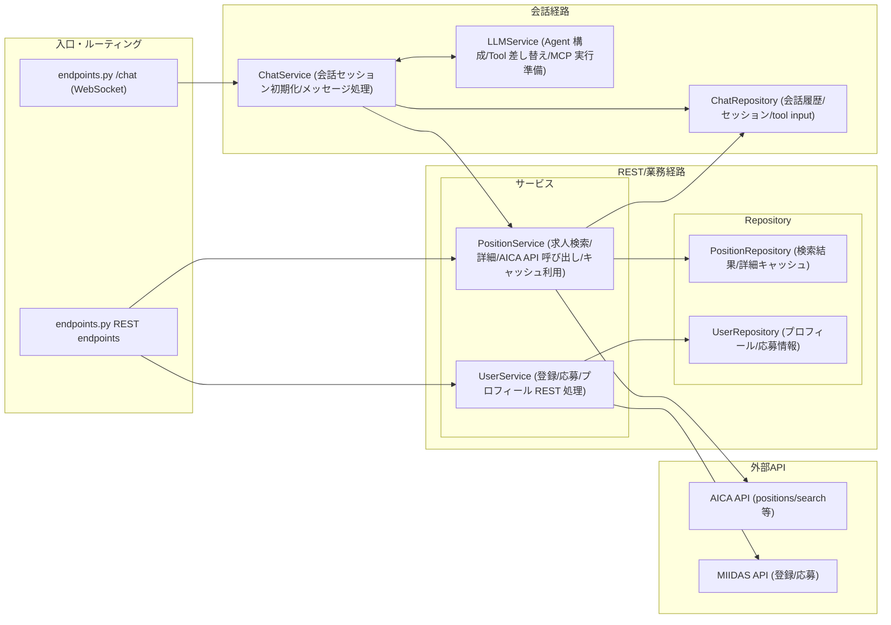
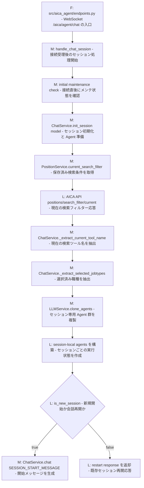
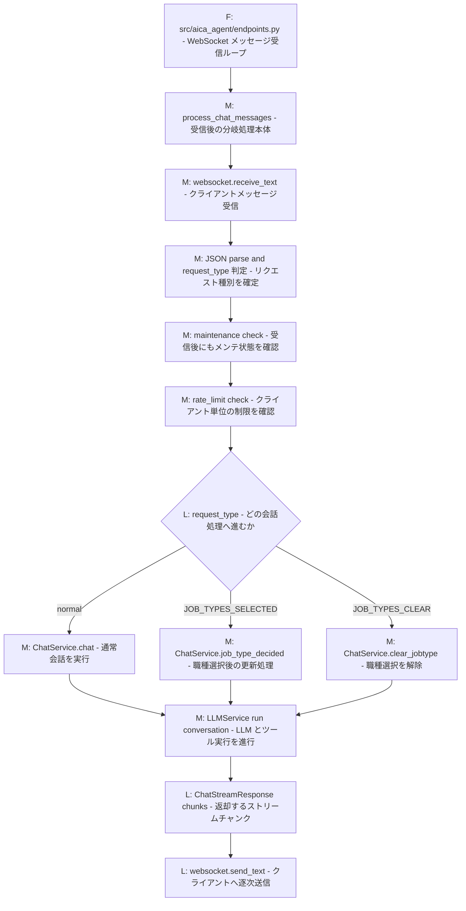
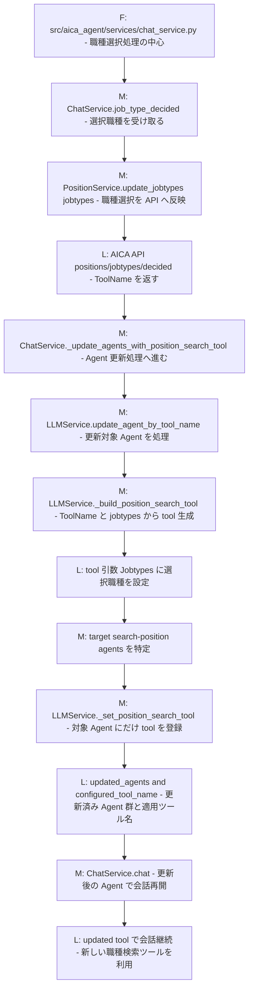
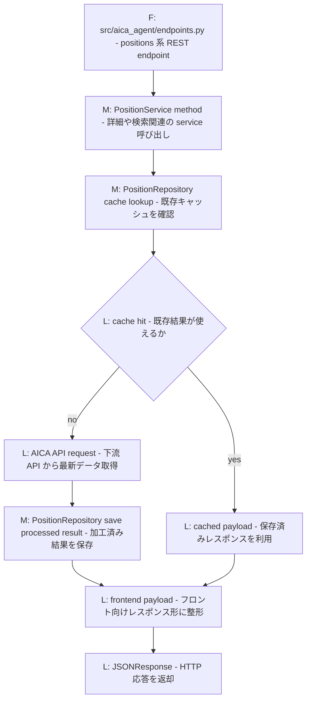
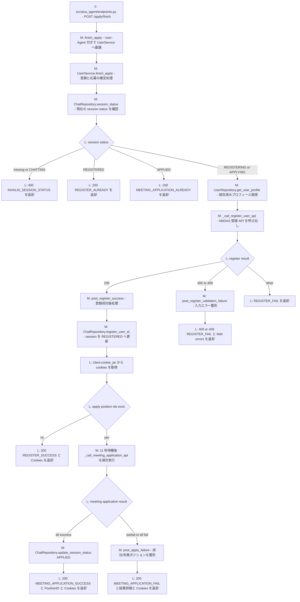

# 概要

AI転職アドバイザーのサーバーです。

AIと会話するためのWebsocket接続、ポジション情報関連のRestful APIを提供します。

> この README に記載する API/ WebSocket のパスは、共通プレフィックス `/aica/agent` 配下で公開されます。

## Websocketエンドポイント

- AI転職アドバイザーと会話する
  - `/aica/agent/chat`

## RestFul APIエンドポイント

REST API のベースパスは `/aica/agent` です。

- ヘルスチェック
  - `/aica/agent/health`
- ポジション検索のもっと見る
  - `/aica/agent/positions/search/{search_key}/{offset}`
- ポジション検索のおすすめ
  - `/aica/agent/positions/recommendations/{search_key}/{encrypted_theme}`
- ポジション詳細
  - `/aica/agent/positions/{encrypted_position_id}`
- 会社詳細
  - `/companies/{encrypted_position_id}`
- 業界詳細
  - `/businesses/{encrypted_position_id}`

# ローカルでの起動

## 事前準備

### Python バージョン

- 必須: Python 3.14 (>=3.14,<3.15)
- 推奨: ワークスペース仮想環境 `.venv-server`

仮想環境作成例（macOS bash）

```
python3.14 -m venv .venv-server
source .venv-server/bin/activate
pip install ./server[dev,test]
```

### DB構築

[aica_db_migrationsリポジトリ](https://github.com/MIIDAS-Company/aica_db_migrations)のREADMEを参照

### 環境変数

- `.env.example`を`.env.local`にコピーしし、値を入れてください。
- `127.0.0.1	pgvector mcp-server api-server`を事前に`/etc/hosts`にいれるとVSCodeとコンテナ内と同じエンドポイントが利用できます。

## 起動コマンド

`./start_server.sh`

## 検証方法

- 基本フロントを起動してブラウザからアクセスして、Agentサーバの機能を確認できます。
- Restful APIの確認は特に開発のときに何回も行うことがあるので、会話しながらLLMにツールを呼び出してもらう必要があるので、面倒かもしれない。
  - そのため、`Agentサーバ.postman_collection.json`を使って確認するのは可能ですが、その前に、一度AI転職アドバイザーとの会話でポジション検索が実行される必要があります。その後、APIに必要な情報：
    - HTTPヘッダーのセッションID。
      - ブラウザのローカルストレージから取得可能
    - リクエストパラメータ
      - search_key: フロント側は複数検索のある場合、区別に利用されうものです。任意で良い。
      - その他: Websocketのポジション検索レスポンスから取得可能

### ローカルでのメンテモード検証

#### メンテモード開始

- 下記のコンテンツでファイル`/tmp/aica.json`を作成します。
```
{
    "isMaintenance": true
}
```
- 下記コマンド実行します。
```
docker cp /tmp/aica.json aica-localstack:/tmp/aica.json
docker exec aica-localstack awslocal s3 cp /tmp/aica.json s3://local-miidas-app/api/v1/maintenance/aica.json
```

#### メンテモード終了

- 下記のコンテンツでファイル`/tmp/aica.json`を作成します。
```
{
    "isMaintenance": false
}
```
- 下記コマンド実行します。
```
docker cp /tmp/aica.json aica-localstack:/tmp/aica.json
docker exec aica-localstack awslocal s3 cp /tmp/aica.json s3://local-miidas-app/api/v1/maintenance/aica.json
```

### `Agentサーバ.postman_collection.json`使い方

#### Postmanインストール

[ここ](https://www.postman.com/downloads/?deviceId=698c1d4d-313f-458e-9700-35f1b77045f2)からダウンロードできます。

#### APIデータインポート

`Agentサーバー.postman_collection.json`をPostmanにインポートしたら、利用できます。

# 開発者向け

## プロジェクト構造

- src/aica_agent/services
  - 業務ロジック層
    - chat_service.py
      - LLM会話関連(Websocketエンドポイント処理)
    - position_service.py
      - ポジション関連（ポジション検索、詳細取得などのRestful APIエンドポイント処理）
    - agent_service.py
      - エージェント関連（AgentRepositoryとPromptRepositoryを連携）
    - llm_service.py
      - LLM Agent初期化とMCPサーバー管理
    - user_service.py
      - ユーザー関連
    - rate_limit_service.py
      - レート制限
- src/aica_agent/repositories
  - データアクセス層
    - agent_repo.py
      - エージェント設定のDB操作
    - prompt_repo.py
      - プロンプトファイルの読み込み（`files/prompts/`から）
    - chat_repo.py
      - チャット履歴のDB操作
    - position_repo.py
      - ポジション情報のDB操作とキャッシュ
    - user_repo.py
      - ユーザー情報のDB操作
    - その他のリポジトリ
- src/aica_agent/domain/entities
  - モデル定義（テーブルORM）
- src/aica_agent/utils
  - 定数、ヘルパークラス、メソッド
- files/prompts
  - エージェントのシステムプロンプトファイル（`{id}_{name}.txt`形式）
- docker
  - コンテナ起動用

## 主に利用しているライブラリ
- openai-agents、mcp、boto3
  - AI関連
- uvicorn、gunicorn、fastapi
  - Websocket、Restful APIサーバー
- psycopg、SQLAlchemy
  - DBアクセス
- dependency-injector
  - 依存性注入（Dependency Injection: DI）

## Agentサーバー内部構成

ここでは、`miidas_aica_agent/server` の主要ファイル、クラス、メソッドを file / class / method レベルで整理します。  
全体連携はルート [README.md](/Users/sei.li/aica/develop-clean/README.md) を参照してください。

### 全体構成と責務分担



### 主要ファイル・クラス・メソッド

- `src/aica_agent/endpoints.py`
  - `handle_chat_session`
  - `process_chat_messages`
  - position 系 REST endpoint 関数群
- `src/aica_agent/services/chat_service.py`
  - `ChatService.init_session`
  - `ChatService.chat`
  - `ChatService.job_type_decided`
  - `ChatService.clear_jobtype`
  - `ChatService._update_agents_with_position_search_tool`
- `src/aica_agent/services/llm_service.py`
  - `LLMService.clone_agents`
  - `LLMService.update_agent_by_tool_name`
  - `LLMService._build_position_search_tool`
  - `LLMService._set_position_search_tool`
- `src/aica_agent/services/position_service.py`
  - `PositionService.current_search_filter`
  - `PositionService.update_jobtypes`
  - `PositionService.clear_jobtypes`

## Agentサーバー REST API 一覧

`src/aica_agent/endpoints.py` の REST API は `APIRouter(prefix=API_PREFIX)` により、ベースパス `/aica/agent` 配下で公開されます。  
`src/aica_agent/endpoints.py` の REST API は、大きく `PositionService`, `UserService`, `ChatService` に委譲されます。  
外部依存としては主に以下を使います。

- `AICA API`
  - ポジション詳細、再検索、検索フィルター、マスター、勤務地、業界、職種などの本体 API
- `MIIDAS API / 本体側 API`
  - 登録、面談応募、応募完了処理
- `Repository / DB`
  - `PositionRepository`, `UserRepository`, `ChatRepository`
- `ActionLogRepository`
  - 検索や推薦などの分析ログ

#### Position 系

- `GET /aica/agent/health`
  - ヘルスチェックです。
  - 外部サービス利用はありません。

- `GET /aica/agent/positions/search/{search_key}/{offset}`
  - 既存検索結果に対する「もっと見る」です。
  - `PositionService.load_more()` を呼びます。
  - `PositionRepository` の検索結果キャッシュ、`ChatRepository` の tool output、`AICA API /positions/summaries`、`ActionLogRepository` を使います。

- `GET /aica/agent/positions/detail/{encrypted_position_id}`
  - ポジション詳細を返します。
  - `PositionService.get_position_detail()` を呼びます。
  - `PositionRepository` キャッシュ、`AICA API /positions/detail/...`、`UserRepository` の応募済みポジション情報を使います。

- `GET /aica/agent/companies/detail/{encrypted_position_id}`
  - 企業詳細を返します。
  - `PositionService.get_company_detail()` を呼びます。
  - `PositionRepository` キャッシュと `AICA API /companies/detail/...` を使います。

- `GET /aica/agent/businesses/detail/{encrypted_position_id}`
  - 事業詳細を返します。
  - `PositionService.get_business_detail()` を呼びます。
  - `PositionRepository` キャッシュと `AICA API /businesses/detail/...` を使います。

- `GET /aica/agent/positions/recommendations/{search_key}/{encrypted_theme}`
  - テーマに対応するおすすめポジションを返します。
  - `PositionService.get_position_recommendation()` を呼びます。
  - `AICA API /positions/recommendations/...`、`PositionRepository`、`ActionLogRepository` を使います。

- `GET /aica/agent/positions/re-search/{tool_call_id}`
  - 過去の tool call 入力を使って再検索します。
  - `PositionService.search_positions_by_tool_call_id()` を呼びます。
  - `ChatRepository` の保存済み tool input、`AICA API /positions/search`、`PositionRepository`、`ActionLogRepository` を使います。

- `POST /positions/search/jobtype_specific`
  - フロントのフィルターモーダルから職種別再検索を行います。
  - `PositionService.jobtype_specific_position_search()` を呼びます。
  - `AICA API /positions/search/jobtype_specific`、`PositionRepository`、`ActionLogRepository` を使います。

- `GET /positions/search_filter/current`
  - 最新のポジション検索フィルターを返します。
  - `PositionService.current_search_filter()` を呼びます。
  - `AICA API /positions/search_filter/current` を使います。

- `GET /positions/search_filter/jobtype?JobtypeName=...`
  - 指定職種の詳細フィルター定義を返します。
  - `PositionService.jobtype_other_filter()` を呼びます。
  - `AICA API /positions/search_filter/jobtype` を使います。

#### Master / Location / Industry / Jobtype 系

- `GET /master/`
  - プロフィール入力などで使う master data を返します。
  - `UserService.search_master_data()` を呼びます。
  - `AICA API /masters/` を使います。

- `POST /location/verify/prefecture/city`
  - 都道府県名・市区町村名の妥当性確認です。
  - `UserService.search_by_prefecture_city_name()` を呼びます。
  - `AICA API /location/verify/prefecture/city` を使います。

- `POST /location/search/commuting_areas`
  - 居住地から通勤可能エリアを取得します。
  - `UserService.search_commuting_areas()` を呼びます。
  - `AICA API /location/search/commuting_areas` を使います。

- `POST /location/search/keyword`
  - キーワードから勤務地候補を検索します。
  - `UserService.search_location()` を呼びます。
  - `AICA API /location/search/keyword` を使います。

- `POST /industry/search/keyword`
  - 業界候補を検索します。
  - `UserService.search_industry()` を呼びます。
  - `AICA API /industry/search/semantic` を使います。

- `POST /jobtype/search/keyword`
  - キーワードから職種候補を検索します。
  - `UserService.search_jobtype_by_keyword()` を呼びます。
  - `AICA API /jobtype/search/semantic` を使います。

- `POST /jobtype/search/names`
  - 職種名から職種情報を検索します。
  - `UserService.search_jobtype_by_names()` を呼びます。
  - `AICA API /jobtype/search/names` を使います。

#### Profile / Apply 系

- `GET /profile`
  - 保存済みプロフィールを返します。
  - `UserService.get_profile()` を呼びます。
  - `UserRepository` を使います。

- `POST /profile/basic`
  - 基本情報を保存します。
  - `UserService.save_basic_profile()` を呼びます。
  - `UserRepository` を使います。

- `POST /profile/education`
  - 学歴を保存します。
  - `UserService.save_education_profile()` を呼びます。
  - `UserRepository` を使います。

- `POST /profile/experience`
  - 職歴を保存します。
  - `UserService.save_experience_profile()` を呼びます。
  - `UserRepository` を使います。

- `POST /profile/preferences`
  - 希望条件を保存します。
  - `UserService.save_preferences_profile()` を呼びます。
  - `UserRepository` を使います。

- `POST /apply/start`
- `POST /apply/{encrypted_position_id}/start`
  - 登録または応募フローを開始し、session status を更新します。
  - `UserService.start_apply()` を呼びます。
  - `ChatRepository`, `UserRepository`, `ActionLogRepository` を使います。

- `PUT /apply/{encrypted_position_id}/add`
  - 進行中の応募フローへポジションを追加します。
  - `UserService.apply_add_position()` を呼びます。
  - `ChatRepository`, `UserRepository` を使います。

- `POST /apply/finish`
  - 登録と応募の確定処理です。
  - `UserService.finish_apply()` を呼びます。
  - `UserRepository`, `ChatRepository`, `PositionService`, `ActionLogRepository` に加えて、MIIDAS API / 本体側 API を使います。
  - 結果に応じて cookie も返します。

- `POST /apply/position/{encrypted_position_id}`
  - 登録済み / 応募済みセッションから個別ポジションへ応募します。
  - `UserService.apply_position()` を呼びます。
  - `PositionService` と MIIDAS API / 本体側 API を使います。

#### Chat History 系

- `GET /chat/{position_id}/exist`
  - 指定ポジションの過去会話履歴があるかを返します。
  - `ChatService.check_if_previous_chat_histories_exist()` を呼びます。
  - `ChatRepository` を使います。

- `GET /chat/previous`
- `GET /chat/previous/{position_id}`
  - メインチャットまたはポジション別チャットの過去履歴を返します。
  - `ChatService.load_previous_chat_histories()` を呼びます。
  - `ChatRepository` を使います。

## Agentサーバー処理フロー

ここからは、Agent サーバーの実行時処理だけを flow でまとめます。  
`endpoints.py` から `ChatService`, `LLMService`, `PositionService`, `UserService` へどう処理が流れるかを追います。

#### `endpoints.py` -> `ChatService.init_session` セッション初期化フロー



`LLMService.clone_agents` で重要なのは、単純な clone ではなく、`tool_name` がある場合に `LLMService._build_position_search_tool(tool_name, jobtype_names)` で jobtype-specific な position search tool を構築し、その tool を `self._search_position_agent_names[model_name]` に含まれる Agent だけへ `LLMService._set_position_search_tool(...)` で登録する点です。  
このとき、選択済み職種は正規化された `jobtype_names` として tool 引数 `Jobtypes` に渡されます。

#### `endpoints.py` -> `process_chat_messages` メッセージ処理ループ



`JOB_TYPES_SELECTED` の詳細な更新内容は、次の `職種選択時ツール差し替えフロー` を参照してください。

#### `chat_service.py` -> `llm_service.py` 職種選択時ツール差し替えフロー



#### `endpoints.py` -> `position_service.py` Position REST フロー



#### `/apply/finish` フロー



`/apply/finish` で外部依存として重要なのは、`UserRepository` と `ChatRepository` によるプロフィール・session status の更新に加えて、`_call_register_user_api()` と `_call_meeting_application_api()` で本体側の登録 / 面談応募 API を呼ぶ点です。  
`endpoints.py` 側では `detail["Cookies"]` を取り出して `response.set_cookie(...)` でフロントへ返しています。

## デバッグ

### コンテナで起動する場合

コンテナで起動されるサービスをデバッグする方法なので、ローカルでのPythonインストールは不要です。

VSCodeで`launch.json`の`[Agent]Remote Debug`を実行すればコンテナでAgentサーバーを起動し、デバッグできます。

#### 備考

デバッグにはポート5678を利用していますので、`lsof -i:5678`で他にポート5678を利用しているサービスがないかを確認してください。

もしあったら、そのポートを解放するか、下記ファイルのデバッグポートを変えてください。
- .vscode/launch.json
- server/docker/compose-agent.yaml

### VSCodeで起動する場合

#### 準備

全体`README`参照

#### 起動方法

VSCodeで`launch.json`の`[Agent]Local Debug`を実行すればAPIサーバーを起動し、デバッグできます。

## 単体テスト

### 概要
単体テストにはpytestとTestClientを使用しており、テストコードは`tests/unit/`に配置しています。

### 実行方法

以下の実行方法のどちらもレポートが出力されます。

#### 全テスト実行:

```
cd server
./run_tests.sh
```

#### 特定ファイルのみ実行（`tests`配下のファイル名、またはパス）:

```
cd server
./run_tests.sh tests/unit/test_chat_history_endpoints.py
./run_tests.sh test_chat_history_endpoints.py
```

#### 特定のテスト関数のみ実行（2つ目の引数に関数名、または`ClassName::test_func`）:

```
cd server
./run_tests.sh tests/unit/test_chat_history_endpoints.py test_has_position_chat_returns_200_when_exists
./run_tests.sh tests/unit/services/test_chat_service.py TestLoadPreviousChatHistories::test_respects_limit_parameter
```

### pytestオプション

テスト結果の詳細を出力
```
pytest -v
```

特定のファイルを実行
```
pytest ファイルパス
```

特定のテスト関数を実行
```
pytest ファイルパス::関数名
```

カバレッジ出力
```
pytest --cov
```

カバレッジレポート出力（HTML）
```
pytest --cov --cov-report=html
```
htmlcovというフォルダが作成され、その中のindex.htmlで確認できます

※その他の出力形式は[ドキュメント](https://pytest-cov.readthedocs.io/en/latest/reporting.html)をご確認ください

## その他

### LLMモデル設定

#### モデル定義

LLMモデルは`src/aica_agent/config.yml`の`model_list`で設定します。

各モデル定義には以下を含めます:
- `model`: モデル名（例: `bedrock/anthropic.claude-3-5-sonnet-20241022-v2`）
- `use_for`: 用途の配列（`agent`, `summary`など）
- `model_settings`: モデル固有の設定（temperature、max_tokensなど）

#### モデルの追加・変更

`src/aica_agent/config.yml`の`model_list`を修正すれば良い。サーバー再起動が必要です。

#### 利用モデルの指定

- エージェント用: `use_for`に`agent`を含むモデルが使用される
- 要約用: `use_for`に`summary`を含むモデルが使用される


# TODO

`logger.log(f"...")`のように`logging-not-lazy`形でログ出力すると、`server/src/aica_agent/utils/log_utils.py`での`record_factory`には、`args`取得できないので、`logging-not-lazy`の書き方はCICDより検出してエラー報告する必要があります。
```
def record_factory(*args, **kwargs):
    """セッションID、リクエストID追加と機密データマスク処理を行うログレコードファクトリ"""
    record = old_factory(*args, **kwargs)
    record.session_id = session_id_var.get()
    record.request_id = request_id_var.get()
    record.caller = record.pathname + ":" + str(record.lineno)
    if not os.environ.get("NOT_MASK_LOG_PAYLOAD") and record.args:
        record.args = mask_log_payload(record.args)
    return record
```
