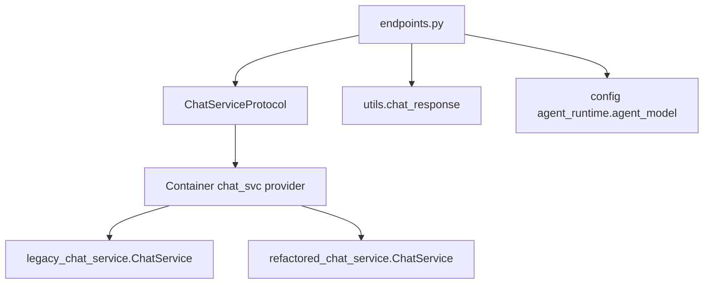
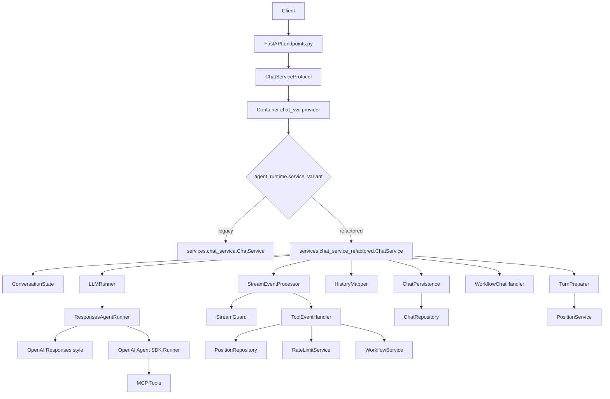
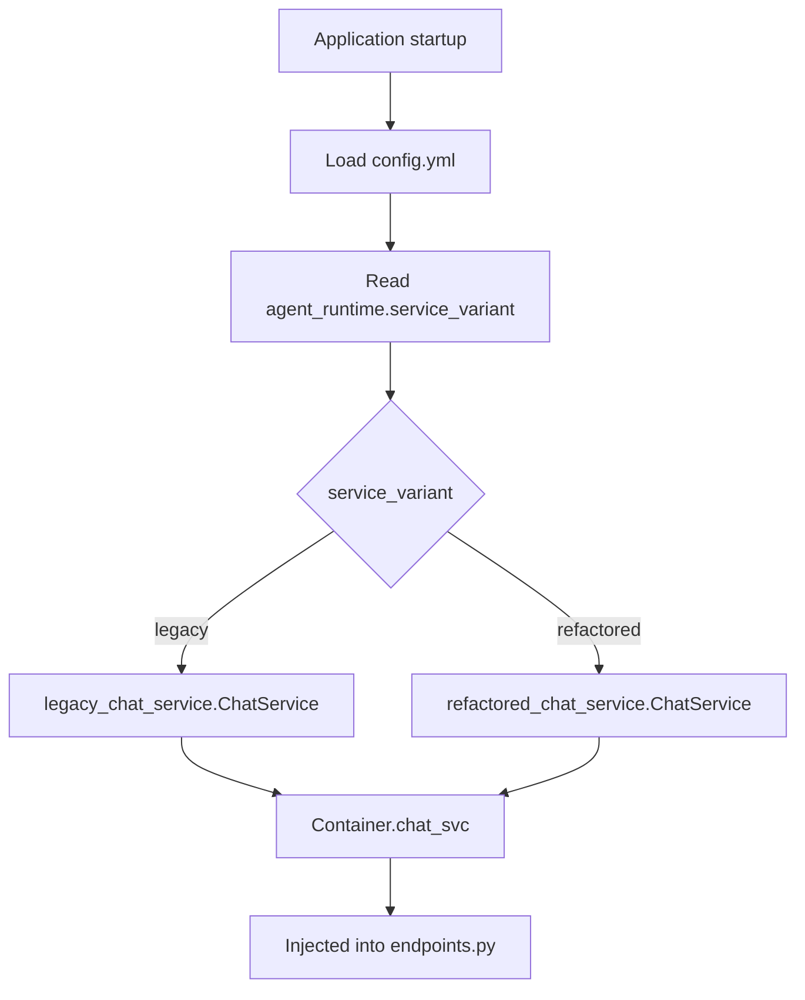
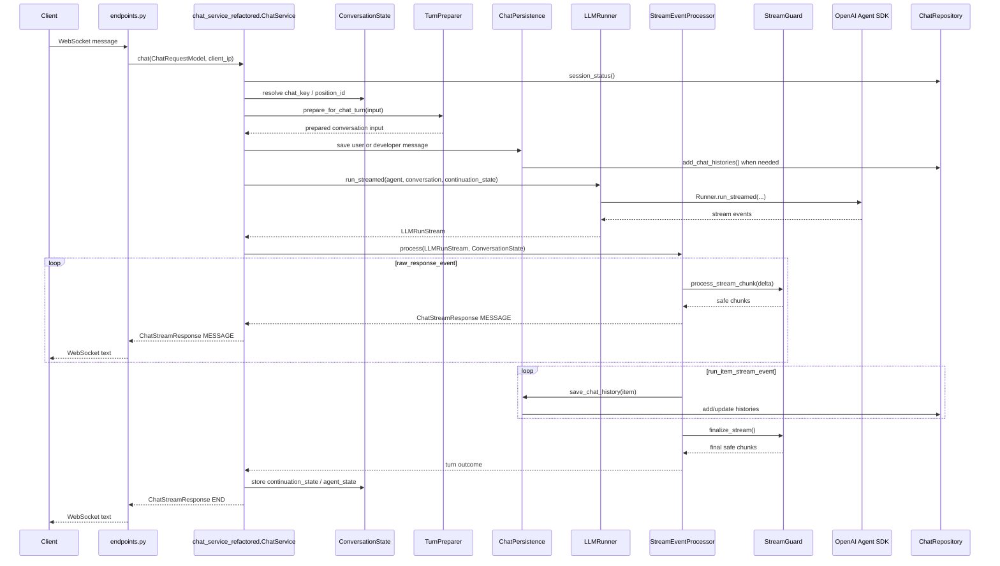
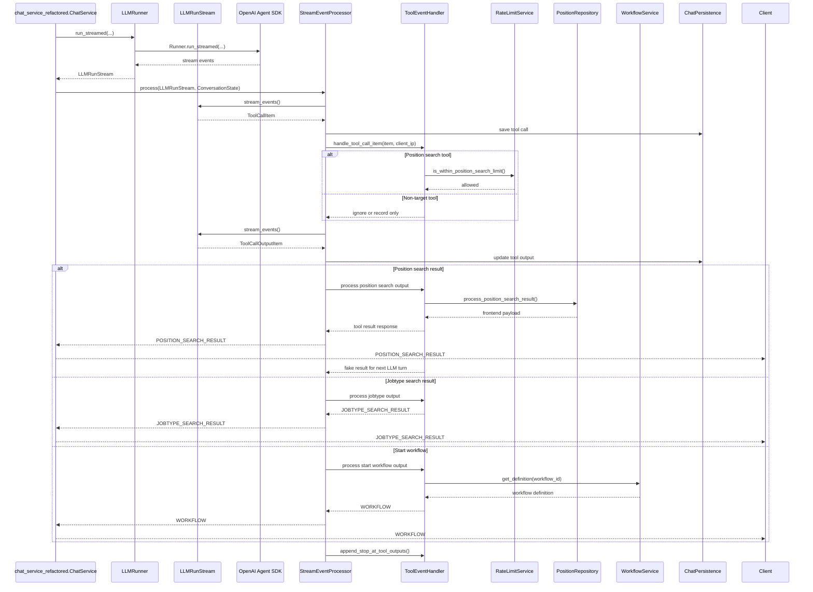
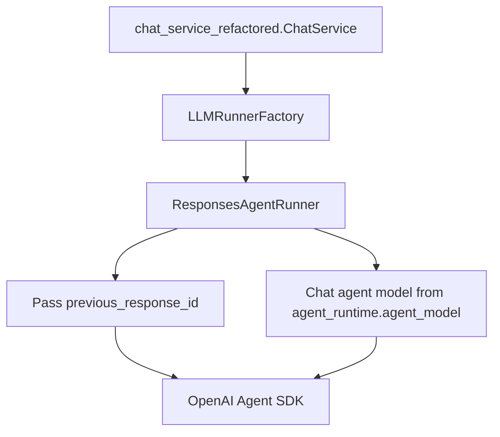
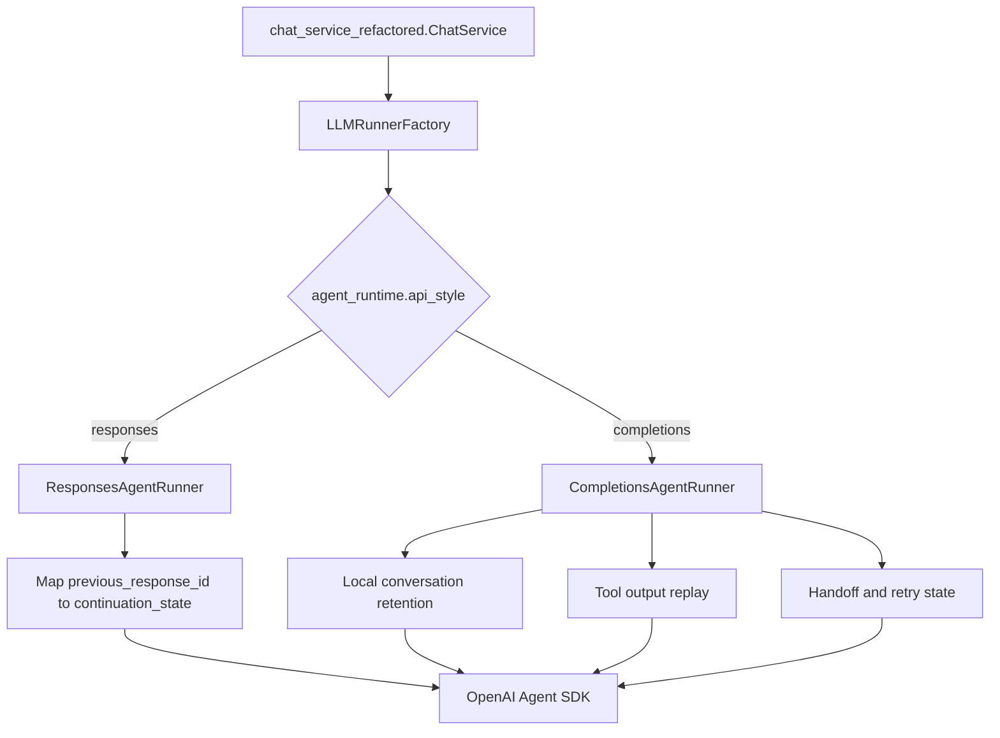
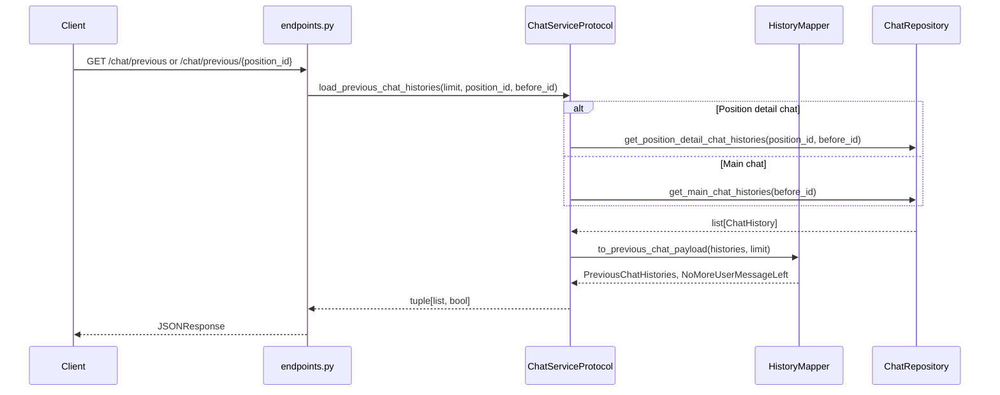
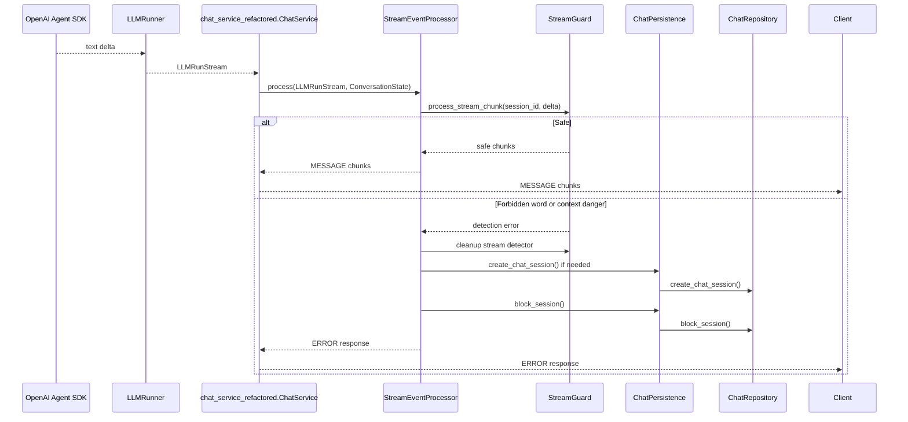

# ChatService Refactored Architecture

## 目的

- `chat_service.py` の外部公開インターフェースを維持する。
- リファクタ版 `chat_service_refactored.py` を現行版と並行存在させ、設定で切り替えられるようにする。
- `endpoints.py` から見える挙動は変えない。
- `chat_service_refactored.py` の内部責務を分割する。
- Gate A では OpenAI Agent SDK + Responses style のまま構造リファクタを完成させる。
- Gate A で導入する config は legacy/refactored の service variant と現行チャットモデル値の明示化に限定する。
- Gate B で Completions style とチャット用 Agent モデル切替を追加する。

## 基本方針

- 現行版とリファクタ版は別ファイルに置く。
- どちらのファイルも公開クラス名は `ChatService` に揃える。
- public method contract は揃えるが、constructor shape は公開契約に含めない。constructor 差分は `containers.py` が吸収する。
- `containers.py` だけが具体実装を選ぶ。
- `endpoints.py` は `ChatServiceProtocol` に依存し、現行版・リファクタ版の差を知らない。
- `endpoints.py` は response model を `services.chat_service` 経由で import しない。`ChatStreamResponse` / `ChatStreamResponseModel` / `ChatResponseType` は `utils.chat_response` から直接利用する。
- `endpoints.py` の `init_session()` model 引数はハードコードせず、config から解決したチャット用 Agent モデルを positional call で渡す。
- `init_session()` の引数名は `model_name` に寄せる。現行名 `provider` は実態とずれているため、`ChatServiceProtocol` / `chat_service_refactored.ChatService` / 必要に応じて legacy `chat_service.ChatService` で `model_name` に揃える。挙動維持のため keyword call が残っていないことを確認する。
- Gate A の config validation owner は `services/chat/config_validator.py` とし、`application.py` startup hook で呼ぶ。invalid config は app startup で fail fast し、module import 時には fail させない。
- `agent_runtime` の読み取りと default model resolver は `services/chat/agent_runtime_config.py` に置く。`config_validator.py` は validator に専念し、resolver を兼ねない。
- `chat_service_refactored.ChatService` と service variant switch が実装登録される task までは `service_variant: legacy` のみ valid とし、`refactored` は implementation 未登録の startup/config validation error にする。Delegating adapter / service variant switch task で `chat_service_refactored.ChatService` と service variant switch が入った時点で `refactored` を valid にする。
- `Container.chat_svc` は singleton ではなく factory とする。WebSocket chat flow では session ごとに別 `ChatService` instance を解決し、REST history/existence path では short-lived stateless instance として扱う。
- Gate A では Responses style の現行 semantics だけを扱う。
- Gate B では Responses style / Completions style の差分を `LLMRunner` に閉じ込める。
- `chat_service_refactored.ChatService` は orchestration に集中し、履歴、ツール、ストリーミング安全検査、LLM 実行を専用コンポーネントへ委譲する。

## モジュール構成

```text
server/src/aica_agent/
  endpoints.py
  containers.py
  services/
    chat_service.py                 # 現行版。移行完了まで変更最小限。
    chat_service_refactored.py      # リファクタ版。クラス名は ChatService。
    llm_service.py
    chat/
      service_protocol.py
      conversation_state.py
      history_mapper.py
      turn_preparer.py
      chat_persistence.py
      stream_event_processor.py
      tool_event_handler.py
      stream_guard.py
      workflow_chat_handler.py
      llm_runner.py
      agent_model_factory.py          # Gate B
```

## Endpoint 境界



禁止する依存:
- `endpoints.py` から `services.chat_service.ChatService` を直接 import しない。
- `endpoints.py` から `services.chat_service.ChatStreamResponse` を import しない。
- `endpoints.py` に `init_session("openai/gpt-4.1")` のようなモデル名ハードコードを残さない。

## 全体フローチャート



## 起動時・DI 切替フロー



想定 import:

```python
from services import chat_service as legacy_chat_service
from services import chat_service_refactored as refactored_chat_service
```

`endpoints.py` 側は具体実装ではなく `ChatServiceProtocol` を型として見る。

## 通常チャットのシーケンス



## ツール実行ありのシーケンス



## Gate A LLM フロー



## Gate B LLM フロー



## LLMRunStream contract

`chat_service_refactored.ChatService` は `ResponsesAgentRunner` / `CompletionsAgentRunner` の違いを直接知らず、下記の contract だけを見る。

```text
LLMRunStream
  stream_events() -> AsyncIterator[LLMStreamEvent]
  continuation_state -> Any
  agent_state -> Any
  tool_replay_items -> list[dict]
  usage -> Any

LLMStreamEvent
  raw_response_event:
    item_id: str
    delta: str
  run_item_stream_event:
    item: MessageOutputItem | ToolCallItem | ToolCallOutputItem | HandoffOutputItem | ReasoningItem
```

Rules:
- Stable service-facing contract は `continuation_state`, `agent_state`, `tool_replay_items`, `usage`, normalized stream event とする。
- Gate A では Responses style のみを対象にし、`ResponsesAgentRunner` が `previous_response_id` / `last_response_id` を `continuation_state` に、`last_agent` を `agent_state` に、`to_input_list()` の replay 対象を `tool_replay_items` に map する。
- `previous_response_id`, `last_response_id`, `last_agent`, `to_input_list()` は Responses compatibility field であり、`chat_service_refactored.ChatService` の stable contract 名にはしない。
- Gate A では SDK-shaped legacy event fixtures を先に作り、Responses adapter normalization tests で `LLMRunStream` contract へ崩さず map されることを固定する。
- Gate B では Completions style を追加し、`continuation_state`, `agent_state`, `tool_replay_items` に adapter-local state を map する。Responses naming を core contract として継承しない。
- Gate B では Responses style / Completions style のどちらでも `ChatService` に見える event stream を同じ形に正規化する。
- Gate B の parity は frontend/API observable behavior に限定する。`previous_response_id` や adapter-local continuation token などの内部 continuation invariants は runner-internal tests で別に固定する。

## 履歴取得のシーケンス



## セキュリティ検知シーケンス



## Cleanup Ownership

- `endpoints.py` の `finally`: request/session context の clear を担う。
- `chat()` async generator の `finally`: `StreamGuard` / `InjectionDetector` / stream-local buffer cleanup の最終保証を担う。
- `StreamGuard`: `InjectionDetector.remove_session(session_id)` による detector state cleanup を担う。
- `ConversationState` 全体は cleanup で逐一空にする前提ではなく、`Container.chat_svc` の factory lifecycle により WebSocket/session ごとに別 instance として破棄・分離される。
- cleanup は idempotent にする。複数レイヤーから同じ `session_id` の cleanup が呼ばれても、2 回目以降は no-op として扱う。

## コンポーネント責務

| Component | Responsibility |
| --- | --- |
| `ChatServiceProtocol` | `endpoints.py` が依存する公開契約。現行版とリファクタ版の同等性をテストする境界。 |
| `chat_service_refactored.ChatService` | 公開メソッドと全体 orchestration。`TurnPreparer` で LLM 呼び出し前の入力を準備し、`LLMRunner` を呼び出し、返ってきた `LLMRunStream` の処理を `StreamEventProcessor` へ委譲する。processor の結果を受けて retry, `ConversationState` 更新, turn 終了判断を行う。 |
| `ConversationState` | WebSocket chat flow のセッション単位 mutable state を保持する。REST の履歴取得・存在確認 path は stateless であり、初期化済み `ConversationState` に依存しない。状態更新の判断は `chat_service_refactored.ChatService` が orchestration として行い、必要に応じて `TurnPreparer`, `LLMRunner`, `ToolEventHandler`, `ChatPersistence` などの結果を受けて `ConversationState` を更新する。`ConversationState` 自身はセッション間で共有せず、業務判断や外部 I/O を持たない。 |
| `TurnPreparer` | 画面種別、position detail、開始メッセージなど、LLM に渡す turn 入力を準備する。LLM 実行結果や stream event は処理しない。 |
| `HistoryMapper` | DB 履歴、Agent SDK input、フロント返却 payload の変換を担う。 |
| `ChatPersistence` | session 作成、chat history 保存、tool output 更新、遅延保存を担う。 |
| `StreamEventProcessor` | `LLMRunStream.stream_events()` の event loop と `event.type` 分岐を担う。`raw_response_event` は `StreamGuard` へ、`run_item_stream_event` は item 種別に応じて `ChatPersistence`, `ToolEventHandler` へ委譲し、frontend response と turn outcome を `ChatService` へ返す。 |
| `ToolEventHandler` | tool call / tool output / stop_at_tool / frontend tool response を処理する。 |
| `StreamGuard` | `InjectionDetector` を使ったストリーミング安全検査、検知結果の返却、detector cleanup を担う。block session の永続化は `StreamEventProcessor` が検知結果を受けて `ChatPersistence` へ委譲する。 |
| `WorkflowChatHandler` | workflow submit / cancel と jobtype selected / clear の前処理を担う。 |
| `LLMRunner` | Agent SDK 実行の抽象。`LLMRunStream` を返し、SDK 固有の実行差分を隠蔽する。stream event の業務処理、履歴保存、frontend response 組み立て、`ConversationState` 更新判断は持たない。 |
| `AgentModelFactory` | Gate B 専用。config から Agent SDK 用 model を解決する。LiteLLM のような汎用 provider proxy ではなく、Agent SDK に渡す model identifier の解決だけを担う。 |

## ファイルゴールと Phase 対応

Gate A の phase は release 単位ではなく、Gate A ミドルブランチ上の作業順序を表す。実際の task PR 数は `refactoring_plan.md` FIX 後に `server/plan/phases/phase-x/features/feature-y/task-z` へ分割して決める。

### Shared Boundary Files

| File | Phase | Change | Goal after phase | Notes |
| --- | --- | --- | --- | --- |
| `server/src/aica_agent/endpoints.py` | Phase 1 | response model import を `utils.chat_response` へ移す。`ChatServiceProtocol` 型へ寄せる。`init_session()` に config 解決済み model を positional call で渡す。 | 具体 `services.chat_service.ChatService` import と model hardcode が endpoint から消える。 | endpoint から見える response shape を変えない。 |
| `server/src/aica_agent/containers.py` | Phase 2 | `service_variant: legacy` の lifecycle test を追加する。 | 既存 `Container.chat_svc` factory lifecycle が保護される。 | singleton 化しない。 |
| `server/src/aica_agent/containers.py` | Phase 2 | Delegating adapter / service variant switch task で `refactored` 解決を追加する。 | legacy/refactored の service variant switch が container に閉じ込められる。 | WebSocket/session ごとに別 instance を解決する。 |
| `server/src/aica_agent/config.yml` | Phase 1 | `agent_runtime.service_variant` と `agent_runtime.agent_model` を追加する。default は現行 `"openai/gpt-4.1"` と同等にする。 | Gate A の service variant と現行 chat model 値が明示化される。 | `api_style` はまだ追加しない。 |
| `server/src/aica_agent/config.yml` | Phase 2 | `chat_service_refactored.ChatService` 登録後に `service_variant: refactored` を valid 化する。 | 設定で refactored を選べる。 | implementation 登録前は clear startup error。 |
| `server/src/aica_agent/config.yml` | Gate B | `agent_runtime.api_style` を追加する。 | Responses / Completions style を設定で選べる。 | Gate A には含めない。 |
| `server/src/aica_agent/application.py` | Phase 1 | `validate_agent_runtime_config(container.config)` を startup hook から呼ぶ。 | invalid config が app startup で fail fast する。 | module import 時には fail させない。 |
| `server/src/aica_agent/services/llm_service.py` | Phase 1 | chat model config 化に伴う現行 agent model 解決を維持する。summary path を runtime switching から分離して残す。 | 現行 Agent 構築と summary behavior が維持される。 | Gate A では summary model 設定を変更しない。 |
| `server/src/aica_agent/services/llm_service.py` | Gate B | 必要なら `AgentModelFactory` との境界を調整する。 | Responses / Completions model 解決が chat runtime から分離される。 | `chat_service_refactored.py` が broad `LLMService` に直接依存しないようにする。 |

### Legacy / Refactored Facade Files

| File | Phase | Change | Goal after phase | Notes |
| --- | --- | --- | --- | --- |
| `server/src/aica_agent/services/chat_service.py` | Phase 1 | 必要に応じて `init_session()` 引数名を `model_name` に寄せる。 | 現行 behavior を維持したまま実態に合う名前になる。 | endpoints からは positional call を維持する。 |
| `server/src/aica_agent/services/chat_service.py` | Phase 3 | SDK-shaped legacy event fixture を差し込める minimal runner seam を追加する。 | legacy characterization tests が可能になる。 | production path は SDK-shaped stream を処理し続け、normalized `LLMRunStream` は直接 consume しない。 |
| `server/src/aica_agent/services/chat_service_refactored.py` | Phase 2 | 一時 delegating adapter として追加する。 | service variant switch と endpoint wiring を検証できる。 | この時点の pass は wiring parity。独立実装 parity ではない。 |
| `server/src/aica_agent/services/chat_service_refactored.py` | Phase 4 bootstrap | main `chat()` path の legacy import / instantiate / delegate をなくし、`LLMRunner` boundary を使う thin real shell にする。 | refactored 実体で `pre_extraction_parity` を通せる。 | 大きな責務分割はまだ行わない。 |
| `server/src/aica_agent/services/chat_service_refactored.py` | Phase 4 extraction | 各責務を `services/chat/` components へ移す。 | public method と orchestration に集中する薄い `ChatService` になる。 | constructor shape は公開契約に含めない。 |
| `server/src/aica_agent/services/chat_service_refactored.py` | Phase 5 | 最終 parity suite と static check を通す。 | legacy と外部挙動が一致し、legacy 依存が再導入されていない。 | 公開クラス名は legacy と同じ `ChatService`。 |

### `services/chat/` Files

| File | Phase | Change | Goal after phase | Notes |
| --- | --- | --- | --- | --- |
| `services/chat/service_protocol.py` | Phase 1 | public method, return type, side effect expectations を定義する。 | `endpoints.py` が依存する public contract が型として固定される。 | legacy/refactored parity test の境界。 |
| `services/chat/agent_runtime_config.py` | Phase 1 | `get_service_variant`, `get_agent_model`, `resolve_default_agent_model` 相当を追加する。 | `agent_runtime` の読み取りと default model resolver が validator から分離される。 | validator と責務を分ける。 |
| `services/chat/config_validator.py` | Phase 1 | `legacy` のみ valid にし、agent model の存在を検証する。 | startup/config validation の owner が固定される。 | implementation 登録前の `refactored` は clear startup error。 |
| `services/chat/config_validator.py` | Phase 2 | refactored implementation 登録後に `refactored` を valid 化する。 | `service_variant: refactored` が選択可能になる。 | silent fallback しない。 |
| `services/chat/llm_runner.py` | Phase 3 | SDK-shaped legacy event fixtures 起点で Responses adapter normalization を固定する。 | `LLMRunner` / `LLMRunStream` stable contract ができる。 | Gate A では Responses style only。 |
| `services/chat/llm_runner.py` | Phase 4 bootstrap | refactored shell がこの boundary を使う。 | main `chat()` path が runner boundary 経由で動く。 | legacy `ChatService` へ delegate しない。 |
| `services/chat/llm_runner.py` | Gate B | Completions runner を追加する。 | Responses / Completions style 差分が runner に閉じ込められる。 | Gate A には含めない。 |
| `services/chat/conversation_state.py` | Phase 4 bootstrap | thin shell で必要最小限の state を持つ。 | refactored 実体で `pre_extraction_parity` を通せる。 | factory lifecycle で session 間分離する。 |
| `services/chat/conversation_state.py` | Phase 4 extraction | `_model_name`, `_active_agent_name`, response ids, conversation, chat key などを移す。 | WebSocket chat flow の session 単位 mutable state が集約される。 | 外部 I/O や業務判断を持たない。REST history path は依存しない。 |
| `services/chat/history_mapper.py` | Phase 4 extraction | `_convert_to_llm_messages`, `_parse_tool_output`, previous history payload 整形を移す。 | DB 履歴、Agent SDK input、frontend payload の変換が集約される。 | DB read/write は持たない。 |
| `services/chat/chat_persistence.py` | Phase 4 extraction | `_save_chat_history`, `_create_session`, `_save_user_or_developer_message`, `_save_llm_error`, `_save_chat_histories` を移す。 | chat/session/history write side effects が集約される。 | 読み取り責務は持たない。 |
| `services/chat/turn_preparer.py` | Phase 4 extraction | `_prepare_for_chat_turn`, `_get_position_detail`, `_get_message_role` を移す。 | LLM に渡す turn input 準備が分離される。 | stream event は処理しない。 |
| `services/chat/stream_event_processor.py` | Phase 4 bootstrap | thin shell で最低限の stream processing を通す。 | refactored 実体で streaming parity を検証できる。 | `LLMRunStream.stream_events()` を pull する。 |
| `services/chat/stream_event_processor.py` | Phase 4 extraction | raw/run item event 分岐、frontend response yield、turn outcome 集約を移す。 | stream event loop と dispatch が集約される。 | `StreamGuard`, `ChatPersistence`, `ToolEventHandler` へ委譲する。 |
| `services/chat/tool_event_handler.py` | Phase 4 extraction | `_handle_tool_call_item`, `_ensure_tool_execution_available`, `_append_stop_at_tool_outputs`, `_is_stop_at_tool`, fake result generation を移す。 | tool-specific behavior が分離される。 | tool-specific dependencies をここに寄せる。 |
| `services/chat/stream_guard.py` | Phase 4 extraction | `InjectionDetector` reset/process/finalize/remove と `_handle_security_detection` 周辺を移す。 | streaming safety check と detector cleanup が分離される。 | block session 永続化は `ChatPersistence` へ委譲する。 |
| `services/chat/workflow_chat_handler.py` | Phase 4 extraction | workflow/jobtype public method の前処理を移す。 | workflow/jobtype 前処理が分離される。 | public method は `ChatService` が維持する。 |
| `services/chat/agent_model_factory.py` | Gate B | `api_style` と `agent_runtime.agent_model` から Agent SDK 用 model を解決する。 | Responses / Completions style の model 解決が分離される。 | Gate A では作らない、または未使用にする。 |

### Test / Plan Support Files

| File / Directory | Phase | Change | Goal after phase | Notes |
| --- | --- | --- | --- | --- |
| `tests/integration/chat_service_contract/` | Phase 1 | legacy 最小 harness を作る。 | endpoint/config 境界の最小 contract が固定される。 | legacy のみ。 |
| `tests/integration/chat_service_contract/` | Phase 2 | delegating adapter を同 fixture に乗せる。 | service variant switch と endpoint wiring を比較できる。 | pass は wiring parity。独立実装 parity ではない。 |
| `tests/integration/chat_service_contract/` | Pre-extraction gate | high-risk invariants を追加する。 | extraction 前の安全網ができる。 | stream ordering, state, tool, security, DB side effects を含む。 |
| `tests/integration/chat_service_contract/` | Phase 4 | extraction ごとに継続実行する。 | 責務移植による挙動差分を検知できる。 | bootstrap 後は refactored 実体に対して実行する。 |
| `tests/integration/chat_service_contract/` | Phase 5 | final parity suite に完成させる。 | legacy/refactored 外部挙動同等性が確認される。 | coverage は補助 evidence。 |
| SDK-shaped legacy event fixtures | Phase 3 | current event shape, ordering, duplicate filtering, handoff item, `to_input_list()` behavior を fixture 化する。 | Responses adapter normalization の元 fixture ができる。 | 新しい `LLMRunStream` から期待値を作らない。 |
| `server/plan/phases/**/task.md` | Planning after plan FIX | phase/feature/task 分割時に template から作る。 | task の目的、scope、done criteria、required command が固定される。 | 原則 template 必須。 |
| `server/plan/phases/**/task.md` | Every task | 実装前に読む。 | task scope drift を防ぐ。 | 変更範囲と必須 test を確認する。 |
| `server/plan/phases/**/handoff.md` | Every task | task 完了時に更新する。 | 次 task の source of truth が残る。 | セッション記憶に依存しない。 |
| `server/plan/phases/**/verification.md` | Every task | required command の結果を更新する。waiver / not-applicable は理由を残す。 | test / rollback subset の結果が追跡できる。 | required command が `fail` / `not-run` のまま `done` にしない。 |
| `server/plan/phases/status.md` | Every task | task status を更新する。 | phase/feature/task の進捗が見える。 | handoff と verification へ link する。 |
| `server/plan/phases/status.md` | Implementation phase | verification との整合性 lint / static check を追加する。 | `done` と verification result の矛盾を防ぐ。 | 複数 Agent 運用の安全網。 |

## 設定

```yaml
agent_runtime:
  service_variant: legacy # legacy | refactored
  agent_model: openai/gpt-4.1
```

意味:
- `service_variant`: `containers.py` が現行版またはリファクタ版の `ChatService` を選ぶ。
- `agent_model`: Responses style で Agent SDK に渡すチャット用 Agent モデル。Gate A ではモデル切替機能ではなく、現行ハードコード値を config に明示化するための設定として扱う。ポジション詳細チャットサマリ用モデルは含まない。
- `model_list`: 利用可能な Agent model 定義の source of truth として残す。
- `agent_runtime.agent_model`: `model_list.use_for: agent` の中から 1 つを選ぶ。
- `agent_runtime.agent_model` が `model_list.use_for: agent` に存在しない場合は startup/config validation で fail fast し、silent fallback しない。
- default config は現行の `init_session("openai/gpt-4.1")` と同じ model を選ぶ。

Gate B で追加する設定:

```yaml
agent_runtime:
  service_variant: refactored
  api_style: completions # responses | completions
  agent_model: <provider/model>
```

意味:
- `api_style`: Gate B で `LLMRunnerFactory` が Responses style / Completions style の runner を選ぶ。現状 Responses style は OpenAI モデル前提で、Completions style の場合のみ OpenAI 以外の provider も利用できる。

ポジション詳細チャットサマリ:
- チャット runtime switching の対象外とする。
- Gate A では既存 summary 実装と `model_list.use_for: summary` の設定を変更しない。

## Gate B 運用アーキテクチャ

### Provider onboarding boundary

- Gate B で non-OpenAI provider（Claude, Bedrock など）を扱うのは `api_style: completions` のチャット path のみとする。
- provider 固有の credential / region / network 到達性は platform responsibility（環境変数、IAM、VPC/egress 設定）として扱い、アプリ側は startup 時 validation と実行時エラー観測に集中する。
- provider 切替は `agent_runtime.agent_model` の設定変更で完結させる。`endpoints.py` や public response contract は provider を意識しない。
- この boundary では non-OpenAI provider の実呼び出しは OpenAI Agents SDK の completions model provider 経由で行う（既定: any-llm、`AICA_COMPLETIONS_PROVIDER=litellm` + optional extra で LiteLLM に切替可）。`AgentModelFactory` は provider が受け取る model identifier の解決だけを担う。そうすることで provider onboarding の責務を config/model resolution と provider selection に限定し、endpoint や summary path へ波及させない。
- completions provider adapter は best-effort / beta とし、Claude / Bedrock 向けの provider backend は structured outputs / tool calling / usage reporting を含めて Gate B の verification で明示的に検証する。検証に失敗した backend は対象外とし、設定 validation で拒否する。失敗時の自動フォールバックは行わず、`api_style: completions` から `responses` への config rollback か、`service_variant: refactored` から `legacy` への config rollback でのみ復旧する。
- summary path は provider onboarding 対象外とし、引き続き `model_list.use_for: summary` を source of truth とする。

### Runtime selection matrix

| service_variant | api_style | Validity | Behavior |
| --- | --- | --- | --- |
| legacy | responses | valid | Gate A 既存 runtime。 |
| legacy | completions | invalid | startup/config validation で fail fast。 |
| refactored | responses | valid | Gate A parity baseline。 |
| refactored | completions | valid | Gate B runtime。provider 拡張対象。 |

Rules:
- 無効な組み合わせは silent fallback せず、app startup で明示エラーにする。
- runtime failover は自動切替ではなく config rollback で行う。

### Gate B verification layers

- Layer 1: observable parity
    - `refactored + responses` と `refactored + completions` の frontend/API observable behavior（response shape, stream ordering, tool result, error/end）を比較する。
- Layer 2: runner-internal invariants
    - completions 固有の `continuation_state`, `replay_items`, handoff/retry state の保持を runner 単体で固定する。
    - `api_style: responses` への戻し、および `service_variant: legacy` への戻しが config-only で成立することを確認する。
- Layer 4: provider backend verification
    - CI では config/schema / contract / runner-internal の自動テストを実行し、verification の一次判定を行う。
    - staging / canary では runtime smoke と healthcheck を使い、実際の provider backend が structured outputs / tool calling / usage reporting を満たすかを確認する。
    - manual verification は新しい provider backend を Gate B に追加する最終承認時のみ行い、通常の回帰判定には使わない。
    - いずれのレイヤでも失敗した backend は本番対象外とし、運用上は config rollback で除外する。

### Rollout and rollback architecture

- Rollout は段階的に行う。
    - 1) staging smoke（workflow 発火/非発火を含む）
    - 2) 低トラフィック canary
    - 3) 段階拡大
- Promotion gate は error rate, latency, tool success rate, conversation completion rate の劣化が許容閾値内であること。
- Promotion gate thresholds は RC 前に必ず具体値を埋める。
- すべての threshold は次の 4 点をセットで記録する: target value, owner, due date, evidence location (dashboard link or runbook path)。
- 記録先は `server/plan/phases/status.md` の Gate B RC checklist か、該当 task の `verification.md` / `handoff.md` のいずれかに固定する。空欄のままでは RC 可否を判断しない。
        - error rate
            - meaning: 失敗した turn / request の割合。provider auth failure, rate-limit failure, final error response を含む。
            - target: TODO
            - owner: TODO
            - due: RC 前
            - evidence: TODO
        - latency p95 delta
            - meaning: baseline と比べた 95 パーセンタイル応答時間の増加幅。
            - target: TODO
            - owner: TODO
            - due: RC 前
            - evidence: TODO
        - tool success rate
            - meaning: tool call が成功した割合。失敗、timeout、invalid output を含まない。
            - target: TODO
            - owner: TODO
            - due: RC 前
            - evidence: TODO
        - conversation completion rate
            - meaning: conversation が正常終了まで到達した割合。stall, error, abort を除外する。
            - target: TODO
            - owner: TODO
            - due: RC 前
            - evidence: TODO
- Abort gate は provider auth エラー、rate-limit エラー、final error response の急増を含む。
- Rollback order:
    - primary: `api_style: completions -> responses`
    - secondary: `service_variant: refactored -> legacy`
- Rollback 後は short smoke（new session, existing session, tool result, workflow, summary）で復旧を確認する。

### Gate B RC checklist

- [ ] 4 つの threshold すべてに non-TODO の target / owner / due date / evidence location が記録されている。
- [ ] threshold evidence の参照先が dashboard link か runbook path になっている。
- [ ] threshold 記録が `server/plan/phases/status.md` か task `verification.md` / `handoff.md` に残っている。
- [ ] RC 判定時にこの checklist を更新し、未記入項目があれば RC を見送る。

### Canonicality

- この節が Gate B の runtime validity matrix / rollout / rollback / observability / threshold の canonical source of truth である。
- `refactoring_plan.md` 側の Gate B 記述は、この節への参照と task/command レベルの要約に留める。

### Observability requirements for Gate B

- 起動ログに `service_variant`, `api_style`, `agent_model`, `summary_model` を出力する。
- turn ログに variant/style/model/provider を含める。
- 最低限の監視対象:
    - provider auth failure
    - provider rate-limit / throttling
    - retry exhaustion
    - final error response rate
    - tool execution failure rate
- Gate B 本番投入前に、上記メトリクスの baseline（responses）と canary（completions）を比較できる dashboard を用意する。

## 境界

- `endpoints.py` から見える公開挙動は変更しない。
- `chat_service.py` と `chat_service_refactored.py` は同時に存在できる。
- 実装選択は `containers.py` に閉じ込める。
- Gate A では Agent 実行 style を変更せず、Responses style の現行 semantics を維持する。
- Gate B では Agent 実行 style の差分を `LLMRunner` に閉じ込める。
- Gate B ではモデル選択を `AgentModelFactory` に閉じ込める。
- Gate B では `LiteLLM` execution path と `AgentModelFactory` を組み合わせ、Agent SDK 向け model identifier の解決と provider execution を分離する。
- Gate A の構造リファクタ完成までは `develop` へ統合しない。

### 用語補足

- このドキュメントでいう `wiring` は、DI コンテナへの登録、factory の差し替え、`service_variant` / `api_style` による runtime 選択分岐、必要な constructor 引数の受け渡しを指す。
- `wiring` に含まれないものは、provider API の仕様変更、LiteLLM の内部実装変更、endpoint の公開契約変更、history / persistence / summary path の責務変更である。
- 本タスク群での変更許可範囲は、各 task.md に書かれたファイルと責務に限定する。runner task であれば `llm_runner.py` とその実行に直接必要な最小限の adapter 参照だけを対象とし、DI コンテナ登録や endpoint 側の配線は対象外とする。
