# 概要

下記の機能を提供しています。
* ポジション検索/詳細取得、職種/業種検索などのAPI
* 職種/業種/ポジションをベクトルするバッチ

## APIを利用するサービス

APIサーバはいま内部サーバ向けのみなので、外部公開しません。

このプロジェクトが提供しているAPIを利用するサービスは以下となります。

* [MCPサーバ](https://github.com/MIIDAS-Company/miidas_aica_mcp)
* [Agentサーバ](https://github.com/MIIDAS-Company/miidas_aica_agent)

# ローカルでの起動

## 事前準備

### DB構築

[aica_db_migrationsリポジトリ](https://github.com/MIIDAS-Company/aica_db_migrations)のREADMEを参照

### 環境変数

`.env.example`を`.env.local`にコピーし、`OPENAI_API_KEY`値を入れてください。

## APIサーバー

### 起動コマンド

`./start_server.sh`

#### MOCKサーバー起動

`./start_server.sh mock`で起動

### API検証方法

[Postman](https://www.postman.com/)を利用しています。

#### Postmanインストール

[ここ](https://www.postman.com/downloads/?deviceId=698c1d4d-313f-458e-9700-35f1b77045f2)からダウンロードできます。

#### APIデータインポート

`APIサーバー.postman_collection.json`をPostmanにインポートしたら、利用できます。

## バッチ

### イメージ作成

```bash
docker build -t aica-batch:latest -f docker/cli/Dockerfile .
```

### 実行

```bash
docker run -it --rm --env-file .env.local --network ai-ca_default aica-batch:latest VectorizerIndustry --provider=openai
```

# 開発者向け

## 開発言語とバージョン

Golang 1.26.5

### 備考

基本最新版にしますので、更新があるときにバージョンアップする予定です。

## APIサーバー内部構成

基本本体側の[miidas_go](https://github.com/MIIDAS-Company/miidas_go)をまねて作っています。

### 主要ファイル・クラス・メソッド

- `src/api/mcptool/http/main.go`
  - `main`
    - logger / DB / Echo server を初期化し、`/aica/mcptool` 配下へ route を配線します。
  - `setupServer`
    - Echo 本体と request logger / error handler middleware を設定します。
  - `setupRoutes`
    - bootstrap に route 登録を委譲します。
- `src/api/mcptool/http/bootstrap.go`
  - `setupRoutesWithOptions`
    - shared dependency を生成し、各 module を組み立てて route を登録します。
  - module factory 群
    - `business` / `company` / `industry` / `jobtype` / `location` / `master` / `position` の本番 or mock 配線点です。
- `src/api/mcptool/http/shared_dependencies_factory.go`
  - shared dependency factory
    - DB provider、`ProviderRepositoryRegistry`、master provider など module 横断依存をまとめて生成します。
- `src/api/mcptool/http/*/route.go`
  - `Setup`
    - module が返す handler を Echo route に結び付けます。
- `src/api/mcptool/http/*/module.go`
  - `NewModule`
    - handler に必要な usecase factory / repository / gateway を fail-fast に注入します。
- `src/api/mcptool/http/*/handler.go`
  - `Handler`
    - request binding、DTO -> usecase model 変換、HTTP response shaping を担当します。

## APIエンドポイント一覧

全 API は `src/api/mcptool/http/main.go` で `/aica/mcptool` 配下に mount されます。

- 事業API
  - route: `src/api/mcptool/http/business/route.go`
  - endpoint: `GET /businesses/detail/position_id/:position_id`
  - 役割: position ID から事業詳細を返します。
  - 主な外部依存: MIIDAS read DB 上の `position` / `business` / `company` repository
- 企業API
  - route: `src/api/mcptool/http/company/route.go`
  - endpoint: `GET /companies/detail/position_id/:position_id`
  - 役割: position ID から企業詳細を返します。
  - 主な外部依存: MIIDAS read DB 上の `position` / `company` / `business` repository
- 業種API
  - route: `src/api/mcptool/http/industry/route.go`
  - endpoint: `POST /industry/search/semantic`
  - 役割: 文から業種を意味検索します。
  - 主な外部依存: `ProviderRepositoryRegistry` 経由の vectorizer / HyDE repository、業種 repository
- 職種API
  - route: `src/api/mcptool/http/jobtype/route.go`
  - endpoints:
    - `POST /jobtype/search/semantic`
    - `POST /jobtype/search/nature`
    - `POST /jobtype/search/names`
  - 役割: 文・性質・名前から職種候補を返します。
  - 主な外部依存: vectorizer / HyDE repository、職種 repository
- 勤務地API
  - route: `src/api/mcptool/http/location/route.go`
  - endpoints:
    - `POST /location/verify/prefecture/city`
    - `POST /location/search/commuting_areas`
    - `POST /location/search/keyword`
  - 役割: 地名検証、居住地からの通勤圏検索、キーワード検索を行います。
  - 主な外部依存: commuting area repository、master cache / master provider
- マスターAPI
  - route: `src/api/mcptool/http/master/route.go`
  - endpoint: `GET /masters/?Names=...`
  - 役割: `Names` クエリで指定した master のみをまとめて返します。`Names` 未指定時は空の `List` を返します。
  - 主な外部依存: master provider
- ポジションAPI
  - route: `src/api/mcptool/http/position/route.go`
  - endpoints:
    - `POST /positions/search`
    - `POST /positions/search/jobtype_specific`
    - `POST /positions/search/it_engineer`
    - `POST /positions/search/financial_sales`
    - `POST /positions/summaries`
    - `POST /positions/detail/:position_id`
    - `GET /positions/recommendations/:theme`
    - `GET /positions/recommendations/it_engineer/:theme`
    - `GET /positions/recommendations/financial_sales/:theme`
    - `POST /positions/jobtypes/decided`
    - `POST /positions/jobtypes/clear`
    - `GET /positions/search_filter/jobtype`
    - `GET /positions/search_filter/current`
  - 役割: 検索、詳細、推薦、職種選択、`job_search_filter` の保存・復元をまとめて扱います。
  - 主な外部依存: MV2 gateway、MIIDAS read DB の position / company repository、agent DB の `job_search_filter` repository、location / master 系 dependency

## APIサーバー処理フロー

### 事業API エンドポイントフロー

##### `GET /businesses/detail/position_id/:position_id`

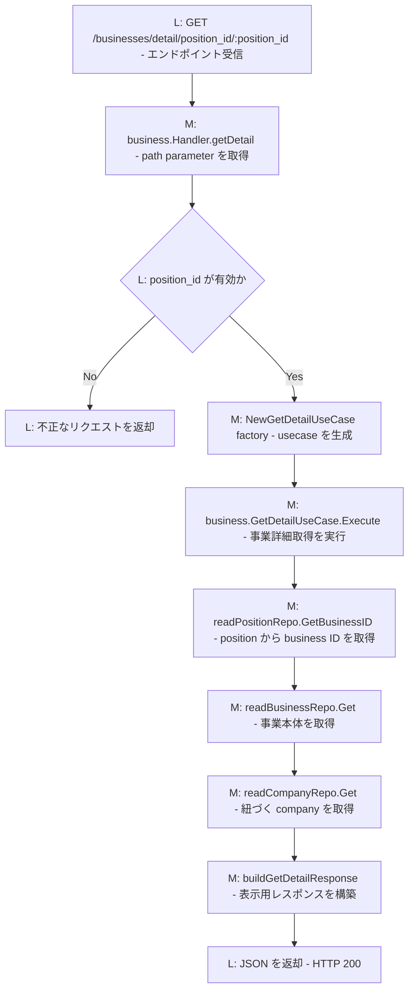

### 企業API エンドポイントフロー

##### `GET /companies/detail/position_id/:position_id`

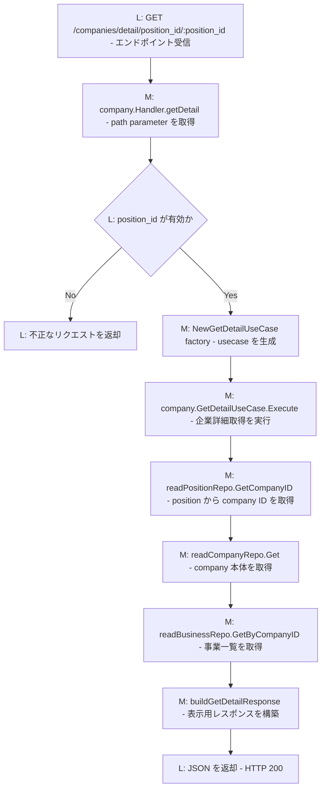

### 業種API エンドポイントフロー

##### `POST /industry/search/semantic`

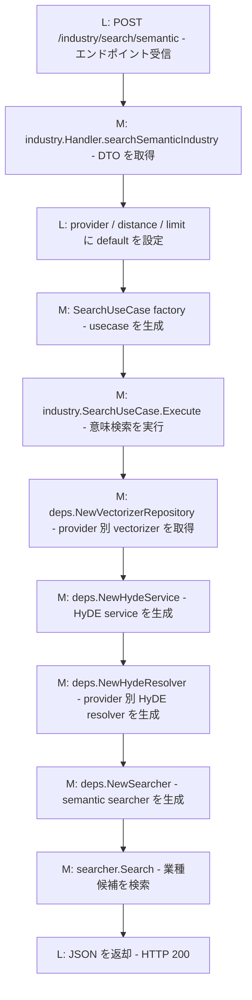

### 職種API エンドポイントフロー

##### `POST /jobtype/search/semantic`

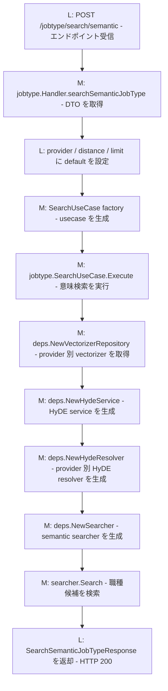

##### `POST /jobtype/search/nature`

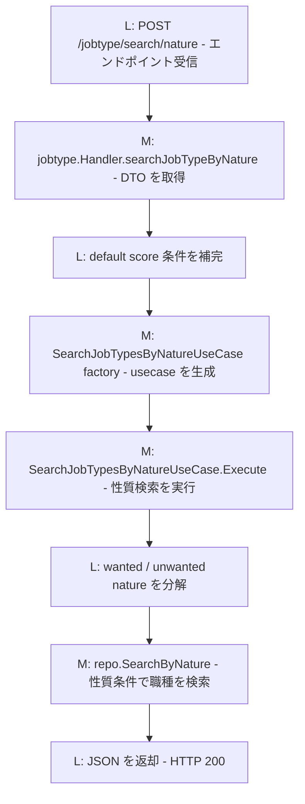

##### `POST /jobtype/search/names`

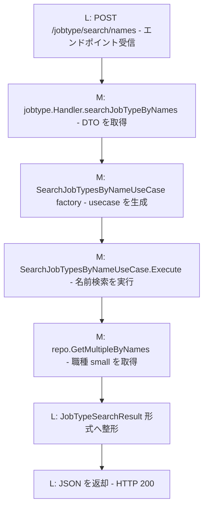

### 勤務地API エンドポイントフロー

##### `POST /location/verify/prefecture/city`

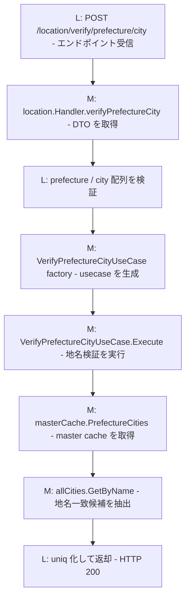

##### `POST /location/search/commuting_areas`

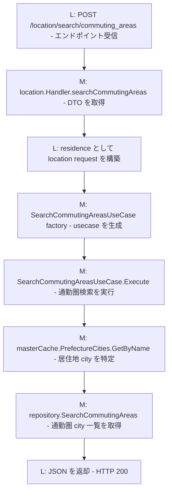

##### `POST /location/search/keyword`

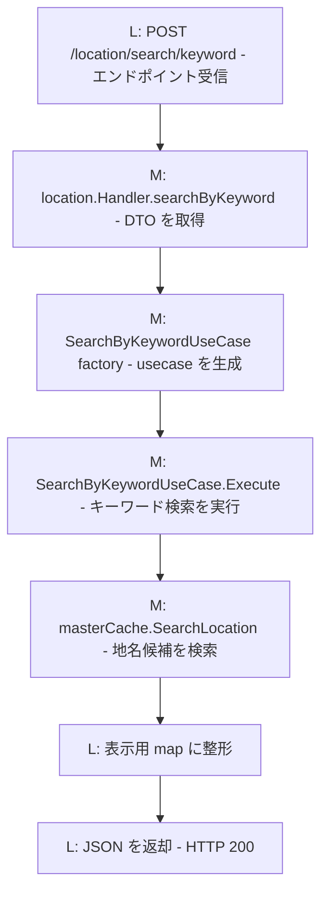

### マスターAPI エンドポイントフロー

##### `GET /masters/`

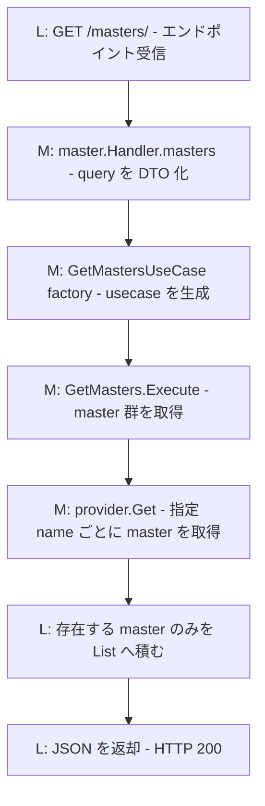

### ポジションAPI エンドポイントフロー

`src/api/mcptool/http/position/route.go` で公開している各エンドポイントについて、handler だけで止めずに mapper / usecase / support / repository・gateway 呼び出しまで追ったメソッドフローです。  
可読性のため、標準ライブラリの細かい処理とログ出力は省略しています。`X-SESSION-ID` を利用するフローは、`job_search_filter` の復元・保存に依存します。

ノードの読み方:
- `M:` 実際に呼ばれるメソッド / 関数
- `L:` 分岐、デコード、HTTP返却などのロジック説明
- メソッドノードは `M: メソッド名 - 何をするか` の形式で記載

##### `POST /positions/search`

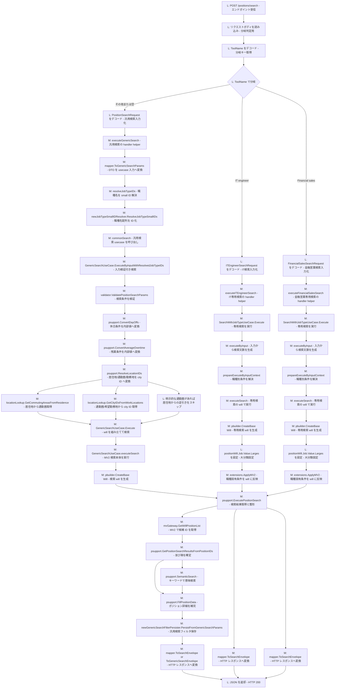

##### `POST /positions/search/jobtype_specific`

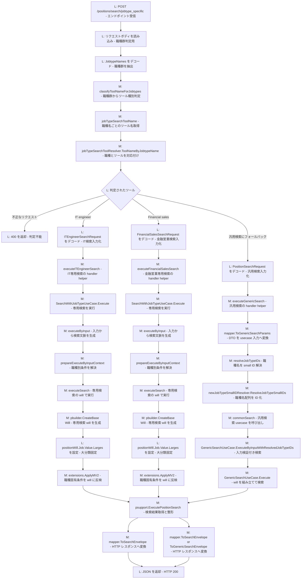

##### `POST /positions/search/it_engineer`

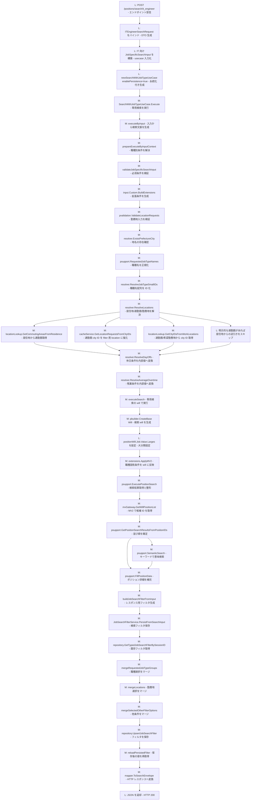

##### `POST /positions/search/financial_sales`

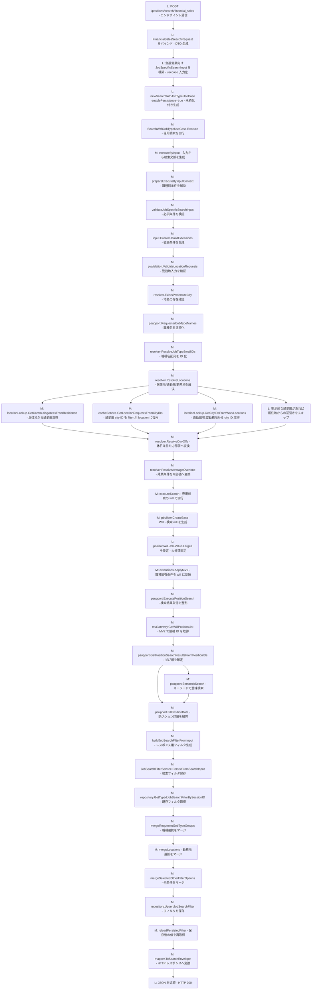

##### `POST /positions/summaries`

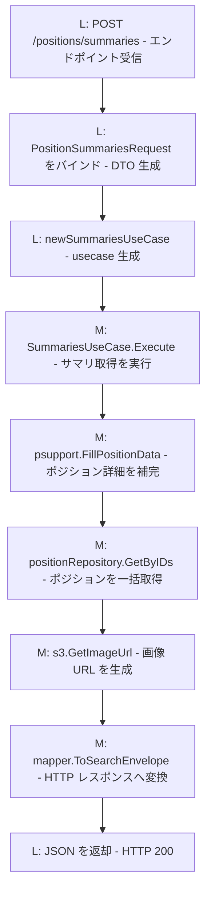

##### `POST /positions/detail/:position_id`

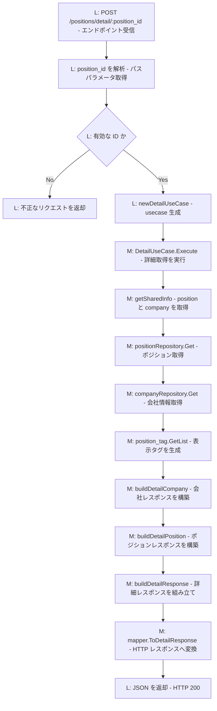

##### `GET /positions/recommendations/:theme`

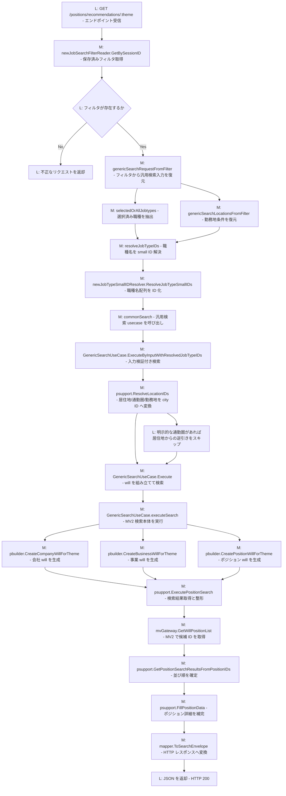

##### `GET /positions/recommendations/it_engineer/:theme`

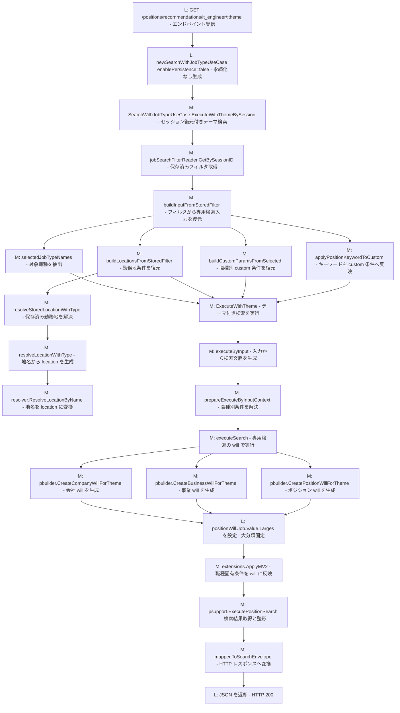

##### `GET /positions/recommendations/financial_sales/:theme`


##### `POST /positions/jobtypes/decided`

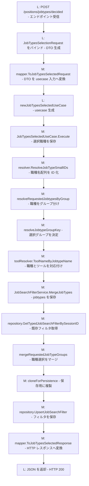

##### `POST /positions/jobtypes/clear`

```mermaid
flowchart TD
    A[L: POST /positions/jobtypes/clear - エンドポイント受信] --> B[L: X-SESSION-ID を取得 - セッション判定]
    B --> C{L: Session ID が存在するか}
    C -->|No| D[L: 不正なリクエストを返却]
    C -->|Yes| E[M: newJobSearchFilterReader.GetBySessionID - 保存済みフィルタ取得]
    E --> F[M: jobtypeNamesFromItems - 保持中職種を抽出]
    F --> G{L: 保持中の jobtype があるか}
    G -->|No| H[L: 空オブジェクトを返却]
    G -->|Yes| I[L: newJobTypesSelectedUseCase - usecase 生成]
    I --> J[M: JobTypesSelectedUseCase.Execute with empty selection - 職種選択を空で保存]
    J --> K[M: resolveRequestedJobtypesByGroup - 空選択のグループを決定]
    K --> L[M: JobSearchFilterService.MergeJobTypes - jobtypes を保存]
    L --> M[M: repository.GetTypedJobSearchFilterBySessionID - 既存フィルタ取得]
    M --> N[M: mergeRequestedJobTypeGroups - 職種選択をマージ]
    N --> O[M: repository.UpsertJobSearchFilter - フィルタを保存]
    O --> P[L: 空オブジェクトを返却]
```

##### `GET /positions/search_filter/jobtype`

```mermaid
flowchart TD
    A[L: GET /positions/search_filter/jobtype - エンドポイント受信] --> B[L: JobTypeSearchFilterRequest をバインド - DTO 生成]
    B --> C{L: JobtypeName があるか}
    C -->|No| D[L: 不正なリクエストを返却]
    C -->|Yes| E[M: mapper.ToJobTypeSearchFilterRequest - DTO を usecase 入力へ変換]
    E --> F[L: newJobTypeSearchFilterUseCase - usecase 生成]
    F --> G[M: JobTypeSearchFilterUseCase.Execute - 職種別フィルタ取得]
    G --> H[M: resolver.ResolveJobTypeSmallIDs - 職種名の妥当性確認]
    H --> I[M: jobSearchFilterService.GetBySessionID - 保存済みフィルタ取得]
    I --> J[M: handler.jobTypeSearchToolName - 対応 tool name を取得]
    J --> K[M: toolResolver.ToolNameByJobtypeName - 職種とツールを対応付け]
    K --> L[M: mapper.ToJobTypeSearchFilterResponse - HTTP レスポンスへ変換]
    L --> M[M: mapper.otherFiltersByToolName - 表示用フィルタ定義を抽出]
    L --> N[M: mapper.selectedFilterOptionsByToolName - 選択中オプションを抽出]
    M --> O[L: JSON を返却 - HTTP 200]
    N --> O
```

##### `GET /positions/search_filter/current`

```mermaid
flowchart TD
    A[L: GET /positions/search_filter/current - エンドポイント受信] --> B[L: newJobTypeSearchFilterUseCase - usecase 生成]
    B --> C[M: JobTypeSearchFilterUseCase.Execute - 現在の職種別フィルタ取得]
    C --> D[M: jobSearchFilterService.GetBySessionID - 保存済みフィルタ取得]
    D --> E[M: selectedToolNameFromFilter - 現在の tool name を判定]
    E --> F{L: 現在のフィルタが存在するか}
    F -->|No| G[M: mapper.ToCurrentJobTypeSearchFilterResponse empty - 空レスポンス生成]
    F -->|Yes| H[M: handler.jobtypeNamesWithSameSearchFilters - 同一フィルタの職種群を抽出]
    H --> I[M: handler.jobtypeNamesByToolName - tool name から職種名取得]
    I --> J[M: toolResolver.JobtypeNamesByToolName - 職種群へ変換]
    J --> K[M: mapper.ToCurrentJobTypeSearchFilterResponse - HTTP レスポンスへ変換]
    K --> L[M: mapper.toJobSearchFilterResponse - search_filters を変換]
    L --> M[M: groupedOtherFiltersResponse - 表示用フィルタ定義を整形]
    L --> N[M: groupedSelectedFilterOptions - 選択中オプションを整形]
    M --> O[L: JSON を返却 - HTTP 200]
    N --> O
    G --> O
```

### バッチ

[Cobra](https://github.com/spf13/cobra)を使ってバッチコマンドを提供します。

#### 入口

`${workspaceFolder}/src/cli/main.go`

#### コマンド一覧

- 業界Embedding作成
  - `src/cli/cmd/vectorizer_industry.go`
- ジョブタイプEmbedding作成
  - `src/cli/cmd/vectorizer_job_type.go`
- ポジションEmbedding作成
  - `src/cli/cmd/vectorizer_position.go`

## デバッグ

### APIサーバー

#### コンテナで起動する場合

コンテナで起動されるサービスをデバッグする方法なので、ローカルでのGolangインストールは不要です。

VSCodeで`launch.json`の`[API]Remote Debug`を実行すればコンテナでAPIサーバーを起動し、デバッグできます。

#### 備考

デバッグにはポート4000を利用していますので、`lsof -i:4000`で他にポート4000を利用しているサービスがないかを確認してください。

もしあったら、そのポートを解放するか、下記ファイルのデバッグポートを変えてください。
- .vscode/launch.json
- docker/run_debug.sh
- docker/compose-api.yaml

#### VSCodeで起動する場合

##### 準備

Golangのインストールが必要。

`brew install go`よりインストールできます。

##### 起動方法

VSCodeでAPIサーバーを起動して、デバッグする方法です。

VSCodeで`launch.json`の`[API]Local Debug`を実行すればAPIサーバーを起動し、デバッグできます。

### バッチ

#### 準備

Golangのインストールが必要。

`brew install go`よりインストールできます。

#### 起動方法

VSCodeで`launch.json`の`[Batch]Local Debug`を実行してください。

## 単体テスト

### 概要
単体テストには標準ライブラリのtestingを使用しており、テストコードはテスト対象のファイルと同じディレクトリに配置しています。

## pre-commit (golangci-lint)

commit 前に `golangci-lint v2.5.0` を実行できます。

### 初回セットアップ

```bash
brew install pre-commit
pre-commit install
```

### 動作

- commit 時に `src/**/*.go` が変更されている場合、以下を実行:
  - `cd src && golangci-lint run --path-mode=abs --config ../.golangci.yml`

### 手動実行

```bash
pre-commit run --all-files
```

### 実行方法

Go module のルートが `src/` なので、基本的には `src/` に移動して実行します。

```bash
cd src
go test ./api/mcptool/...
```

### go test オプション

特定のディレクトリ配下の全ての全パッケージのテストを実行
```bash
cd src
go test ./api/mcptool/usecase/position/...
```

テスト結果の詳細を出力
```bash
go test -v
```

特定の関数を実行
```bash
go test -run 関数名（正規表現）
```

カバレッジ出力
```bash
## オプション無し
go test -cover

## 詳細出力
go test -cover -v
```

カバレッジレポート出力（HTML）
```bash
# カバレッジファイル生成
go test -coverprofile=coverage.out

# HTMLレポート生成
go tool cover -html=coverage.out -o coverage.html
```
coverage.htmlファイルが作成されます（ファイル名は指定可能です）

## API全体 リファクタリング詳細

主目的は、HTTP層とUsecase層の責務分離・依存の明確化・モック切替容易性の向上です。  
以下では、全APIに共通する方針と、特に変更規模の大きい position の詳細を記載します。

### 目的

- HTTP DTO と Usecaseモデルの混在解消
- ユースケース単位の依存契約（interface）を明示して注入点を統一
- モック起動時にインフラ依存を切り離せる構成への統一

### 目的（position固有）

- 検索処理の拡張ポイント（職種別条件・拡張条件・バリデーション）の明確化
- `job_search_filter` の永続化/復元の整合性向上
- セマンティック検索、勤務地解決、MV2検索の責務を分離しやすい構成への整理

### リファクタリング方針（全API共通）

- HTTP層とUsecase層の境界を厳密化
- `module + handler_interface + handler/mock + route` へ構造統一
- 依存契約（interfaces/contracts）を明示し、実装の注入点を `main`/`bootstrap` に集約
- モック切替はcomposition root（`main` + `bootstrap`）で制御

### 依存関係の方針（Usecaseはinterface依存）

現在、Usecaseは concrete class（具体実装）に直接依存せず、各機能の `usecase/*/interfaces` で定義した interface に依存します。

- 例:
  - `PositionSearchValidator` / `PositionSemanticResolver`
  - `JobSearchFilterReader` / `JobSearchFilterGenericPersister`
  - `LocationLookup`
  - 他APIも同様に、各 `usecase/*/interfaces` や handler用契約に依存

メリット:

- 実装差し替えが容易
  - 本番実装/モック実装を `main` / `bootstrap` で切り替えやすい
- テスト容易性が向上
  - Usecase単体テストでstub/mockを注入しやすい
- 依存方向が安定
  - Usecaseが下位実装詳細（DB/外部API/HTTP）に引きずられにくい
- 変更影響を局所化
  - 実装変更時もinterface契約を維持すればUsecase側の修正を最小化できる

### Handler / UseCase のライフサイクル方針（全API共通）

- Handler は起動時に `module` で生成し、アプリ稼働中は再利用する（実質シングルトン運用）。
- UseCase は Handler が持つ factory 関数経由でリクエストごとに生成する。
  - 例: `h.newGetDetailUseCase(logger).Execute(...)`
  - 例: `h.newSemanticUseCase(logger).Execute(...)`
- 依存の実装選択（本番/モック）は `bootstrap` で注入し、Handler/UseCase 本体に環境分岐を持たせない。

### UseCase factory 命名規約（全API共通）

- UseCase の契約インターフェース名は `XxxUseCase` に統一する。
  - 例: `GetDetailUseCase`, `SemanticJobTypeUseCase`, `GetMastersUseCase`
- factory 関数型は `NewXxxUseCaseFunc` に統一する。
  - 例: `NewGetDetailUseCaseFunc`, `NewSemanticJobTypeUseCaseFunc`
- Handler の injected field は `newXxxUseCase` に統一する。
  - 例: `newGetDetailUseCase`, `newSemanticUseCase`
- Handler / Module で usecase factory の fallback は持たない。
- 必須 factory / dependency は `module.NewModule(...)` で fail-fast に検証し、未注入時はエラーを返す。
- 例外として、`bootstrap.go` の `setupRoutesOptions` には composition root 用の既定値があり、未指定時は `default...Factory` が使われる。

### Repository ライフサイクル方針（全API共通）

- Repository は原則、起動時に生成して再利用する（app-lifetime singleton-style）。
- 依存注入は `bootstrap` / `module` で行い、Handler/UseCase内部で都度 `New...Repository(...)` しない。
- この方針は「RepositoryはDB接続ラッパーで基本的に状態を持たない」ことを前提にする。
- Usecase の `New...UseCase(db, ...)` 形式の legacy constructor は廃止し、Repository注入コンストラクタに統一する。
- 例外は、明確にリクエストスコープ状態を持つ実装か、外部制約でapp-lifetime再利用できない実装に限定し、理由をコードコメントで明示する。
- `HyDERepository` / `VectorizerRepository` の provider別インスタンス管理は `ProviderRepositoryRegistry` が担当する。
  - `src/api/mcptool/service/provider_repository_registry.go`
  - provider正規化と fallback 方針もここに集約する
  - `shared_dependencies_factory.go` で app-lifetime の registry を生成し、各 module から利用する

### Strict DI PR チェックリスト（短縮版）

PR description に以下を貼り、該当項目を確認する:

- [ ] `module.NewModule(...)` で必須 factory / dependency の nil を fail-fast 検証している
- [ ] Handler に fallback (`if factory == nil`) を持ち込んでいない
- [ ] Usecase は factory 経由で per-request 生成される
- [ ] Repository は composition root（`bootstrap` / module）で app-lifetime に生成・注入される
- [ ] provider別 Repository（HyDE / Vectorizer）は `ProviderRepositoryRegistry` 経由で取得している
- [ ] `New...UseCase(db, ...)` のような DB 直接受け取りの legacy constructor を追加していない
- [ ] module / handler / usecase テストが strict DI 契約を前提に更新されている

### 構成（現在）

#### HTTP層（transport）

- 共通構造
  - `handler.go`: 本番ハンドラ
  - `handler_mock.go`: モックハンドラ
  - `handler_interface.go`: route が依存する契約
  - `module.go`: 本番依存の組み立て
  - `module_mock.go`: モック依存の組み立て
  - `route.go`: ルート登録
- position固有
  - `src/api/mcptool/http/position/dto/`
  - `src/api/mcptool/http/position/mapper/`
  - `src/api/mcptool/http/position/module.go`
- 共有の composition root
  - `src/api/mcptool/http/bootstrap.go`
  - `src/api/mcptool/http/shared_dependencies_factory.go`
  - `src/api/mcptool/http/bootstrap_build_prod.go`
  - `src/api/mcptool/http/bootstrap_build_mock.go`

#### Usecase層（application）

- 主要ユースケース
  - `src/api/mcptool/usecase/position/search.go`
  - `src/api/mcptool/usecase/position/search_with_jobtype.go`
  - `src/api/mcptool/usecase/position/detail.go`
  - `src/api/mcptool/usecase/position/summaries.go`
  - `src/api/mcptool/usecase/position/jobtypes_selected.go`
  - `src/api/mcptool/usecase/position/jobtype_search_filter.go`
- サブパッケージ
  - `builder/`: MV2向け Will 組み立て
  - `contracts/`: ユースケース向け契約/値オブジェクト
  - `extensions/`: 検索拡張条件適用
  - `filter/`: `job_search_filter` のマージ/永続化
  - `interfaces/`: 依存インターフェース
  - `model/`: transport非依存の Usecase モデル
  - `params/`: IT/金融営業ごとの条件定義とセットアップ
  - `support/`: 共有ユーティリティ/検索パイプライン
  - `validation/`: 入力バリデーション
  - `shared/semantic/`: 職種/業種向けの共通セマンティック検索

#### Domain層（position関連）

- `src/api/mcptool/domain/mv2/`
  - MV2 gateway 抽象化
- `src/domain/jobfilter/`
  - `job_search_filter` の型定義と永続化
- `src/domain/position/`
  - ポジションのベクトル検索 repository
- `src/domain/user/apply/position/`
  - MIIDAS側のポジション参照 repository

### Bootstrap / 起動時配線

- ルート構成オプション:
  - `src/api/mcptool/http/bootstrap.go`
- 起動時に mock/real を選択して依存を注入:
  - `src/api/mcptool/http/main.go`
- build tag ごとの差し替え:
  - `src/api/mcptool/http/bootstrap_build_prod.go`
  - `src/api/mcptool/http/bootstrap_build_mock.go`
- `./start_server.sh mock` は `mock` build tag を渡して起動する

### 主な変更ポイント

#### 1. DTO境界の明確化

- HTTP層DTOを `http/*/dto` に集約
- Usecaseの入出力型は `usecase/*/model` や各機能の request model に集約
- 変換責務は `http/*/mapper` に集約

#### 2. 職種別検索ロジックの分離

- 職種共通と職種固有の責務を分離
  - 共通: `search.go`
  - 固有: `search_with_jobtype.go`, `params/*`
- `position` では汎用検索と職種別検索を別経路で扱う
  - `POST /positions/search`
  - `POST /positions/search/jobtype_specific`
  - `POST /positions/search/it_engineer`
  - `POST /positions/search/financial_sales`

#### 3. `job_search_filter` の整理

- 汎用検索入力の保存と職種別検索入力の復元を分離
- 選択状態は session 単位で `job_search_filter` に保持する
- `position/handler.go` と `position/filter/` で永続化/読み出し責務を分担する

#### 4. バリデーションと補助ロジックの分離

- 汎用検索条件と勤務地条件を `validation/` と `support/` に分離
- 地域解決は `LocationLookup` 経由に統一
- 職種・業種のセマンティック解決は `shared/semantic/` に集約

#### 5. セマンティック検索依存の整理

- HyDE生成と embedding 取得は `ProviderRepositoryRegistry` を通して解決する
- `position/module.go` では職種/業種向け semantic resolver を組み立てて再利用する
- `industry` / `jobtype` も同じ shared semantic service を利用する

#### 6. モック起動対応

- モック時は `bootstrap_build_mock.go` で module factory と shared dependency factory を差し替える
- `NewMockModule` と mock shared factory を使い、本番ハンドラに条件分岐を持ち込まない
- mock 切替は環境変数ではなく build tag で制御する

### 今後の変更時ガイド

- HTTP DTO と Usecaseモデルを混在させない
- 新しい依存は `usecase/*/interfaces` または handler 契約に追加し、usecaseは interface で受ける
- モジュール組み立てと実装選択は `main` / `bootstrap` / `bootstrap_build_*` で完結させる
- provider別の AI repository 生成は `ProviderRepositoryRegistry` に集約する
- モック実装は本番ロジックに条件分岐を入れず、別実装として分離する

## HTTPハンドラ構造統一（positionパターン準拠）

`business/company/industry/jobtype/location/master/position` すべてで、HTTP層の構造を以下に統一しています。

- `handler.go`: 本番ハンドラ
- `handler_mock.go`: モックハンドラ
- `handler_interface.go`: route が依存する契約
- `module.go`: 本番依存の組み立て
- `module_mock.go`: モック依存の組み立て
- `route.go`: `Setup(e, module)` で登録

統一したメリット:

- 配線責務が `main` / `bootstrap` に集約され、依存関係が追いやすい
- build tag で対象モジュールを一括でモック切替できる
- ハンドラ単体差し替えが容易で、ローカルデバッグやAPI疎通確認がしやすい
- fail-fast な依存チェックで、起動時に設定漏れを検知しやすい
