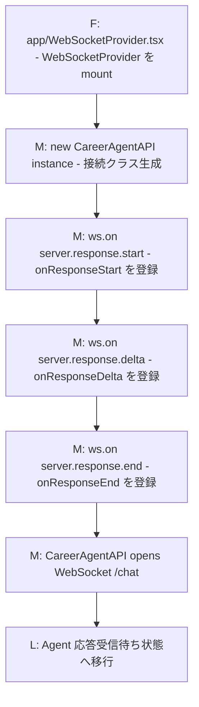
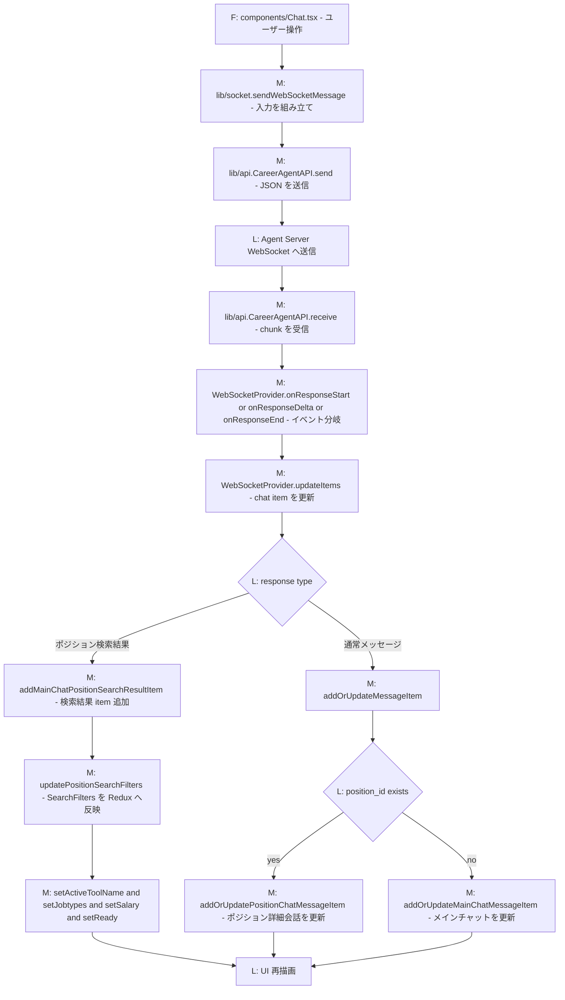
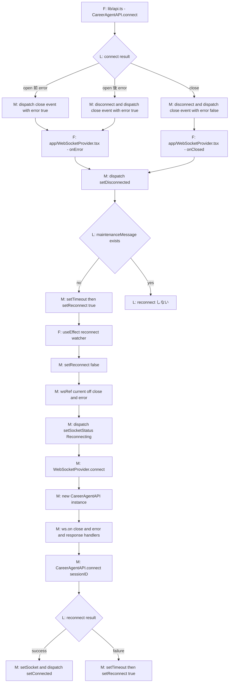
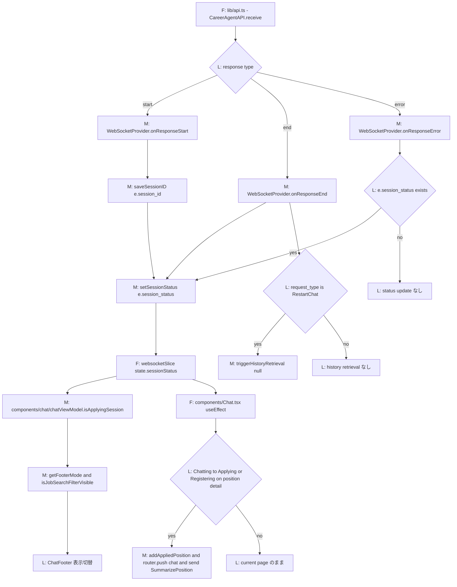
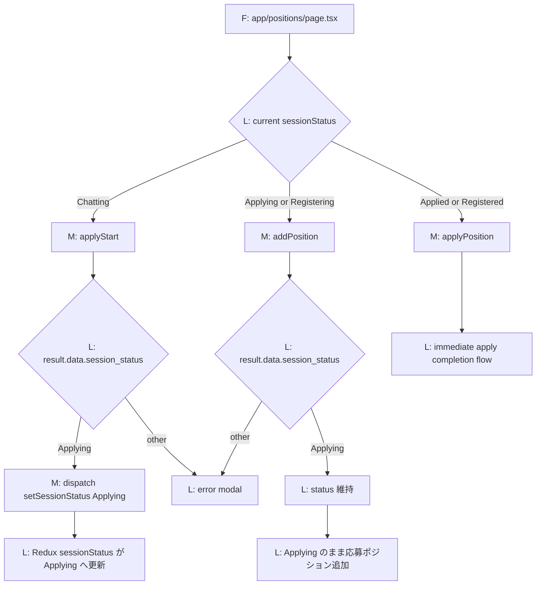
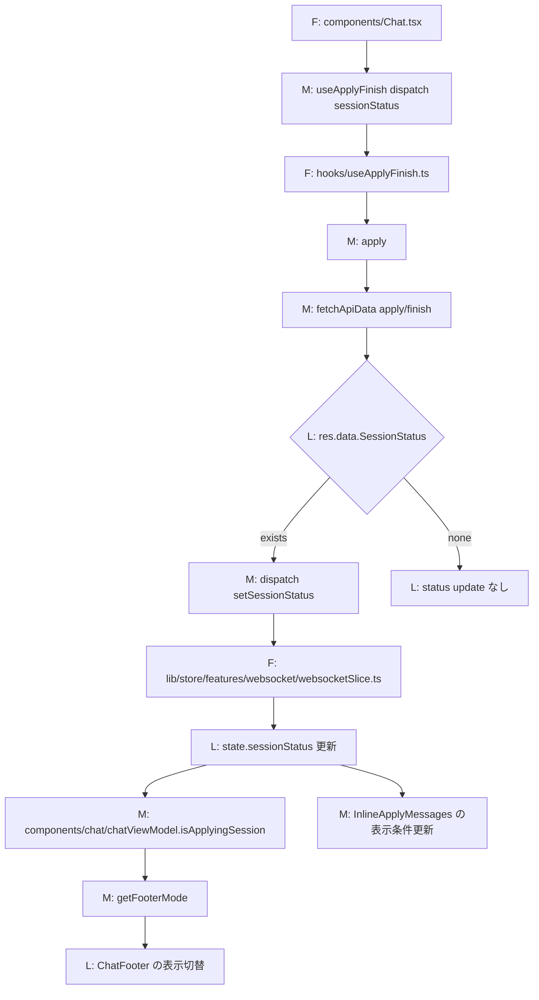
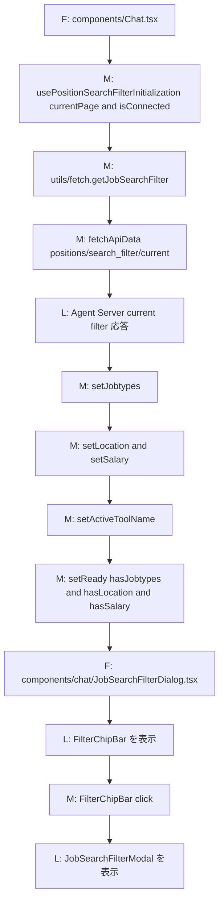
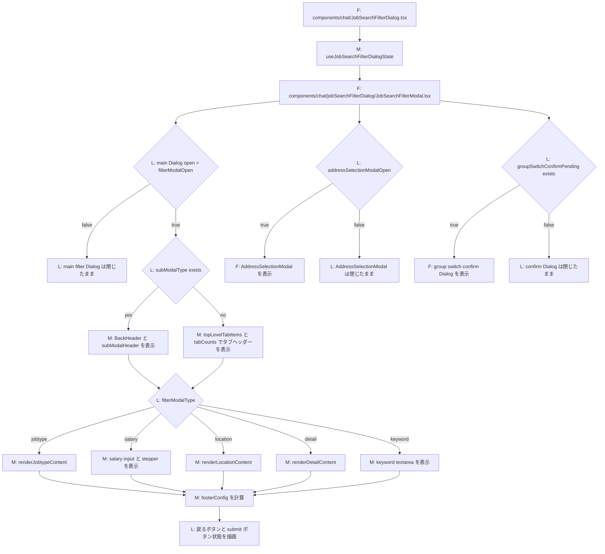
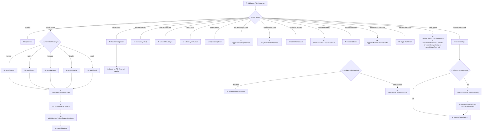
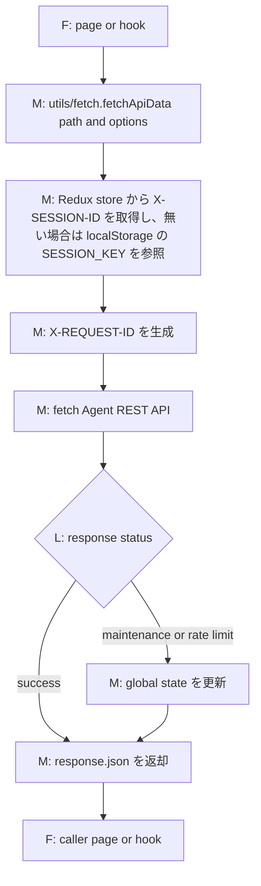

# 概要

AI転職アドバイザーのフロントエンド

現在以下の機能を提供しています。

- AI転職アドバイザーとの会話
  - ジョブタイプ検索フィルタリング
  - ポジション検索結果
  - 給与・勤務地・スキル条件による絞り込み
- ポジション詳細画面
  - ポジション詳細についてのお問い合わせ
- 登録・応募（作成中）

# ローカルでの起動

## 事前準備

### 環境変数

`.env.example`を`.env.local`にコピーしてください。

## 起動コマンド

`start_frontend.sh`

## 利用方法

ブラウザを起動して、`http://localhost`にアクセスしてください。

# 開発者向け

## 開発言語と主に利用しているライブラリ

- Node.js 22
- Typescript
- Next.js
- Redux
- MUI

## プロジェクト構造

基本Next.jsの[おすすめ](https://nextjs.org/docs/app/getting-started/project-structure)通りに構成しています。

### 画面

- メインチャット
  - app/chat
  - AI 転職アドバイザーとの会話、検索結果表示、検索フィルター操作の中心画面です。
  - 主な UI
    - components/Chat.tsx
      - チャット画面全体の組み立てと、会話・履歴・応募導線の制御を担当します。
    - components/chat/JobSearchFilterDialog.tsx
      - フィルターチップバー、フィルターモーダル、職種ヘルプ導線を束ねます。
- プロフィール入力
  - app/basic-info
    - 氏名、連絡先、生年月、居住地などの基本情報を入力します。
  - app/career
    - 職歴、経験職種、勤務先情報などを入力します。
  - app/education
    - 学歴、学校種別、英語レベルなどを入力します。
  - app/will
    - 希望年収、希望勤務地、希望職種などを入力します。
- ポジション詳細
  - app/positions
  - 求人詳細、会社情報、応募開始導線、ポジション別チャットを表示します。
  - 基本本体側のポジション画面からそのまま持ってきている部分が多いです。

### コンポーネント

- チャット共通
  - components/Chat.tsx
    - チャット画面の親コンポーネントです。履歴取得、スクロール、応募状態遷移を束ねます。
  - components/chat/ChatBody.tsx
    - チャット本文領域を描画し、一覧・インラインメッセージ・プロフィール導線を配置します。
  - components/chat/ChatItemList.tsx
    - 会話アイテム配列を走査してメッセージや検索結果を描画します。
  - components/chat/ChatFooter.tsx
    - 入力欄、再接続表示、応募ボタン表示をセッション状態に応じて切り替えます。
- チャットアイテム
  - メッセージ
    - components/ChatMessage.tsx
      - `ChatMessage`, `Error`, `Unknown` を含むテキスト系アイテムを表示します。
  - ポジション検索結果
    - components/PositionSearchResult.tsx
      - ポジション一覧、もっと見る、おすすめ取得導線を表示します。
  - 過去履歴のポジション検索リンク
    - components/PositionSearchLinkCard.tsx
      - 過去履歴から復元した検索条件リンクを表示し、再検索結果へ差し替える導線を持ちます。
  - 職種候補カード
    - components/JobtypeChoiceCard.tsx
      - 職種候補を選択して `JOB_TYPES_SELECTED` へ進むカードを表示します。
  - ポジション検索結果のおすすめ
    - components/positions/recommendations/RecommendationList.tsx
      - おすすめ一覧全体を表示します。
    - components/positions/recommendations/RecommendationItem.tsx
      - 各おすすめカードを表示します。
- 検索フィルター UI
  - components/chat/JobSearchFilterDialog.tsx
    - フィルター UI 一式の表示条件を管理し、バー・モーダル・ヘルプを束ねます。
  - components/chat/jobSearchFilterDialog/FilterChipBar.tsx
    - 現在選択中のフィルター件数をチップバーとして表示し、モーダル起動入口になります。
  - components/chat/jobSearchFilterDialog/JobSearchFilterModal.tsx
    - 職種、勤務地、年収、その他条件、フリーワードの編集モーダル本体です。
  - components/chat/jobSearchFilterDialog/JobtypeHelpDialog.tsx
    - 職種説明の補助ダイアログを表示します。
- 入力 / 接続状態 UI
  - components/UserInput.tsx
    - ユーザーメッセージ入力と送信を担当します。
  - components/ReconnectingIndicator.tsx
    - WebSocket 再接続中の状態を表示します。
- 応募 / 登録 UI
  - components/chat/InlineApplyMessages.tsx
    - 応募/登録中や失敗時のインラインメッセージを表示します。
  - components/chat/ApplyOnboardingPanel.tsx
    - 応募/登録フロー開始時の案内パネルを表示します。
  - components/chat/ApplyResultDetail.tsx
    - 応募結果の詳細を表示します。
  - components/chat/SalaryInput.tsx
    - 応募/登録導線で使う年収入力 UI を提供します。
- ポジション詳細
  - `components/Chat.tsx` はポジション詳細画面でも再利用されています。
  - それ以外の詳細表示コンポーネントは、基本本体側から持ってきているものが中心です。

### Redux

`lib/store`

`lib/store/index.ts` では、次の slice を `websocket`, `globalState`, `profile`, `masterdata`, `positionSearch` として組み立てています。

- `lib/store/features/websocket/websocketSlice.ts`
  - WebSocket 会話の中心 state です。
  - `sessionStatus`
  - `socketStatus`
  - `sessionID`
  - メインチャット / ポジション別チャットの会話履歴
  - ポジション検索結果とおすすめから作る `positions`
  - 履歴取得状態
  - スクロールイベント
  - メンテナンスメッセージ
- `lib/store/features/position_search/positionSearchSlice.ts`
  - ポジション検索フィルター state です。
  - `ready`
  - `activeToolName`
  - `jobtypeGroups`
  - `salary`
  - `positionKeyword`
  - `residence`
  - `commutingAreas`
  - `workLocations`
  - `remoteWorkPossible`
  - 職種別の `otherFilters`
  - 職種別の `selectedFilterOptions`
  - `sameOtherFilterJobtypes`
- `lib/store/features/profile/profileSlice.ts`
  - 応募 / 登録フロー用のプロフィール state です。
  - `appliedPositions`
  - `savedProfileRetrieved`
  - `basicInfo`
  - `education`
  - `career`
  - `will`
  - 各フォームの `applyErrors`
- `lib/store/features/masterdata/masterdataSlice.ts`
  - プロフィール入力などで使う master data の cache です。
  - 英語レベル
  - 学校区分
  - 学校
  - 学部系統
  - 専門学校区分
- `lib/store/features/global_state/globalStateSlice.ts`
  - 画面横断の UI state です。
  - 初回 toast の close 状態
  - ポジション詳細チャット吹き出しの close 状態
  - どのポジションカードを開いたかの `positionItemKey`
  - 利用規約同意状態

### セレクタ

`lib/store/hooks.ts`にmemoised selectorsが定義されており、不要な再レンダリングを防ぎます。
新しいセレクタが必要な場合はここに追加してください。

主なセレクタ：
- `selectPositionSearchReady` - フィルター準備状態

### その他

`utils/fetch.ts`以外は、基本ポジション詳細のため本体側から持ってきているものです。

## フロントエンド処理フロー

ここでは、`miidas_aica_frontend` の内部処理を file / class / method レベルでまとめます。  
全体連携はルート [README.md](https://github.com/MIIDAS-Company/aiagent_sandbox/blob/master/aica/README.md) を参照してください。

### 図の凡例

- `F`
  file レベルの処理起点です。
- `M`
  method または関数呼び出しです。
- `L`
  処理結果、分岐点、状態、または外部レイヤー到達を表す説明ラベルです。

### 主要ファイル・クラス・メソッド

- `app/WebSocketProvider.tsx`
  - `WebSocketProvider`
  - `connect`
  - `disconnect`
  - `onClosed`
  - `onError`
  - `onResponseStart`
  - `onResponseDelta`
  - `onResponseEnd`
  - `onResponseError`
  - `updateItems`
- `lib/api.ts`
  - `CareerAgentAPI`
  - `connect`
  - `disconnect`
  - `send`
  - `receive`
- `lib/socket.ts`
  - `sendWebSocketMessage`
- `components/Chat.tsx`
  - `usePositionSearchFilterInitialization(...)`
  - `sendWebSocketMessage(...)`
- `hooks/usePositionSearchFilterInitialization.ts`
  - `usePositionSearchFilterInitialization`
- `utils/fetch.ts`
  - `fetchApiData`
  - `getJobSearchFilter`
- `lib/store/features/websocket/websocketSlice.ts`
  - `setSessionStatus`
  - `saveSessionID`
  - `triggerHistoryRetrieval`
- `components/chat/chatViewModel.ts`
  - `isApplyingSession`
  - `getFooterMode`
  - `isJobSearchFilterVisible`
- `hooks/useApplyFinish.ts`
  - `useApplyFinish`
- `components/chat/JobSearchFilterDialog.tsx`
  - `JobSearchFilterDialog`
  - `FilterChipBar` の表示と modal 開閉の接続点
- `components/chat/jobSearchFilterDialog/JobSearchFilterModal.tsx`
  - `JobSearchFilterModal`
  - `renderJobtypeContent`
  - `renderLocationContent`
  - `renderDetailContent`
  - `handleDialogClose`
- `components/chat/jobSearchFilterDialog/useJobSearchFilterDialogState.ts`
  - `useJobSearchFilterDialogState`
  - `openFilter`
  - `closeAllModals`
  - `applyJobtype`
  - `applySalary`
  - `applyKeyword`
  - `applyLocation`
  - `applyDetail`
  - `cancelJobtype`
  - `cancelSalary`
  - `cancelKeyword`
  - `cancelLocation`
  - `cancelDetail`
  - `selectJobtype`
  - `confirmGroupSwitch`
  - `selectAddress`

#### `app/WebSocketProvider.tsx` / `lib/api.ts` WebSocket 初期化フロー

#### `lib/socket.ts` -> `lib/api.ts` -> `app/WebSocketProvider.tsx` 会話ストリームフロー

#### `app/WebSocketProvider.tsx` / `lib/api.ts` 再接続フロー

#### `app/WebSocketProvider.tsx` / `websocketSlice.ts` session status 変更フロー

#### `app/positions/page.tsx` session status 変更フロー

#### `components/Chat.tsx` -> `hooks/useApplyFinish.ts` session status 変更フロー

#### `hooks/usePositionSearchFilterInitialization.ts` フィルター復元フロー

#### `JobSearchFilterModal.tsx` 描画フロー

#### `JobSearchFilterModal.tsx` イベントフロー

#### `utils/fetch.ts` REST 共通処理フロー

## デバッグ

### コンテナで起動する場合

コンテナで起動されるサービスをデバッグする方法なので、ローカルでのNode.jsインストールは不要です。

VSCodeで`launch.json`の`[Frontend]Remote Debug`を実行すればコンテナでフロントエンドを起動し、デバッグできます。

### VSCodeで起動する場合

#### 準備

Node.jsインストール参照

#### 起動方法

VSCodeでMCPサーバーを起動して、デバッグする方法です。

VSCodeで`launch.json`の`[Frontend]Local Debug`を実行すればフロントエンドを起動し、デバッグできます。

## ポジション詳細モックデータについて

ポジション詳細画面開発時に一時的に利用したものなので、いまは基本利用しないです。

### 環境変数設定

`NEXT_PUBLIC_MOCK_API=true`追加

### モックデータ場所

`public/mock/api/responses`

position、companies、businessesにそれぞれjsonファイルを用意する必要があり、
ファイル名はposition IDとなります。

### アクセス方法

http://localhost:3000/positions?positionId=ポジションID

## Node.jsのバージョン管理

### インストール

[nvm](https://github.com/nvm-sh/nvm)を使ってNode.jsのバージョンを管理できます。

ほかにも、`nodenv`や`anyenv`などのNode.jsバージョン管理ツールもありますので、自由に選んでください。

#### nvm導入

https://github.com/nvm-sh/nvm?tab=readme-ov-file#installing-and-updating

https://github.com/nvm-sh/nvm?tab=readme-ov-file#usage

#### nodenv導入

https://qiita.com/282Haniwa/items/a764cf7ef03939e4cbb1

#### anyenv導入

https://qiita.com/rinpa/items/81766cd6a7b23dea9f3c

## 静的ファイル作成

### ローカルで作成

#### 開発環境向け

- `build`フォルダを削除
- `.env.example`を`.env.dev`にコピーして、開発環境のエンドポイントに変更
- `npm run build`を実行

#### ステージング環境向け

- `build`フォルダを削除
- `.env.example`を`.env.stg`にコピーして、ステージング環境のエンドポイントに変更
- `npm run build`を実行

#### 本番環境向け

- `build`フォルダを削除
- `.env.example`を`.env.prd`にコピーして、本番環境のエンドポイントに変更
- `npm run build`を実行

### Githubアクションより作成

#### 開発環境向け

`develop`ブランチにマージすれば、Github Actionが検証環境向けの静的ページを生成し、ブランチ`build-dev`にビルドされた静的ファイルが保存されます。

#### ステージング環境向け

まだない。

#### 本番環境向け

`main`ブランチにマージすれば、Github Actionが検証環境向けの静的ページを生成し、ブランチ`build-prod`にビルドされた静的ファイルが保存されます。

# TODO

`.husky`を使って、prettierやlinkチェックができれば良い。

本体側がすでにあるみたい
