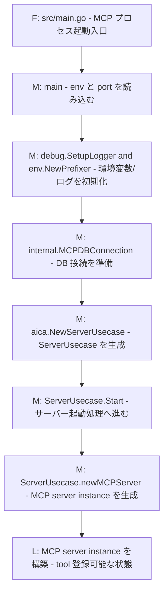
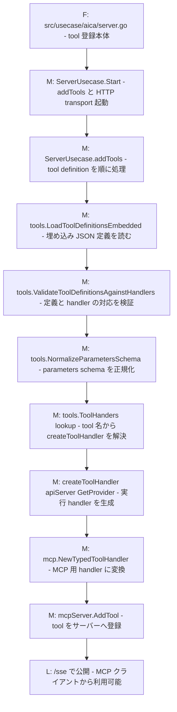
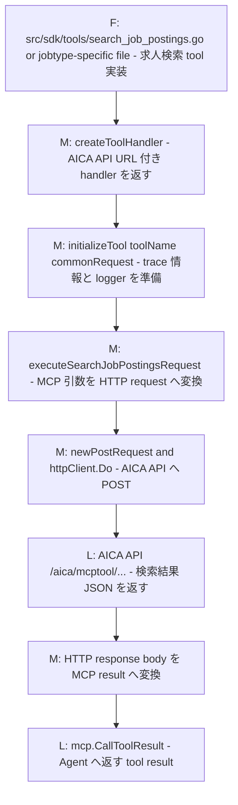
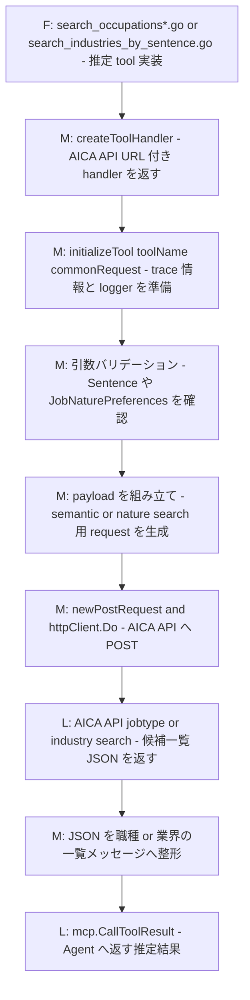

# 概要

AICAプロジェクトのMCPサーバー

## Model Context Protocol（MCP）とは
https://modelcontextprotocol.io/introduction 参照

## TODO

ツール変更通知はまだできてない。
ここで使っている[mcp-go](https://github.com/mark3labs/mcp-go)も、公式のTypescriptなどのSDKも、全クライアントへの通知機能がないです。
１つのサーバなら、全クライアントへの通知機能をSDKに追加するのは可能だが、サーバ複数がある場合、修正が多分結構大きくなります。
なので、たぶん、MCP利用するバックエンドAPIのほうは、定期プロンプト、ツールを更新する機能を追加するのはやりやすいかも

# ローカルでの起動

## 事前準備

### DB構築

[aica_db_migrationsリポジトリ](https://github.com/MIIDAS-Company/aica_db_migrations)のREADMEを参照

### 環境変数

`.env.example`を`.env.local`にコピーしてください。

## 起動コマンド

`./start_server.sh`

## 検証方法

### 利用ツール

[MCP Inspector](https://github.com/modelcontextprotocol/inspector)

### 起動コマンド

`./start_inspector.sh`

### 検証方法

http://localhost:6274
にアクセスして、「Transport Type」に「SSE」を選んで、「URL」に
http://localhost:8080/sse
を入力して、`Connect`ボタンを押して、`Connected`と表示されたら、接続成功となります。

その後、`Tools`タブでツールの確認ができます。

# 開発者向け

## 開発言語とバージョン

Golang 1.26.5

### 備考

基本最新版にしますので、更新があるときにバージョンアップする予定です。

## プロジェクト構造

### MCPサーバー

#### 入口

`${workspaceFolder}/src/main.go`

#### ツール実装

`src/sdk/tools`

## MCPサーバー内部構成

ここでは、`miidas_aica_mcp` の主要ファイル、クラス、メソッドを file / class / method レベルで整理します。  
全体連携はルート [README.md](https://github.com/MIIDAS-Company/aiagent_sandbox/blob/master/aica/README.md) を参照してください。

### 図の凡例

- `F`
  file レベルの処理起点です。
- `M`
  method または関数呼び出しです。
- `L`
  処理結果、分岐点、状態、または外部レイヤー到達を表す説明ラベルです。

### 主要ファイル・クラス・メソッド

- `src/main.go`
  - `main`
- `src/usecase/aica/server.go`
  - `ServerUsecase.Start`
  - `ServerUsecase.newMCPServer`
  - `ServerUsecase.addTools`
- `src/sdk/tools/tool_definitions_loader.go`
  - `LoadToolDefinitionsEmbedded`
  - `ValidateToolDefinitionsAgainstHandlers`
- `src/sdk/tools/tool_schema_normalizer.go`
  - `NormalizeParametersSchema`
- `src/sdk/tools/tool_handlers.go`
  - `ToolHanders`
- `src/sdk/tools/search_job_postings.go`
  - `toolSearchJobPosting.createToolHandler`
- `src/sdk/tools/search_job_postings_for_it_engineer.go`
  - `toolSearchJobPostingsForITEngineer.createToolHandler`
- `src/sdk/tools/search_job_postings_for_sales_financial_sales.go`
  - `toolSearchJobPostingsForSalesFinancialSales.createToolHandler`
- `src/sdk/tools/common.go`
  - `initializeTool`
  - `executeSearchJobPostingsRequest`
- `src/sdk/tools/form_registration.go`
  - `toolFormRegistration.createToolHandler`
- `src/sdk/tools/form_application.go`
  - `toolFormApplication.createToolHandler`

### MCPツールの主なカテゴリ

- 求人検索ツール
  - `search_job_postings`
  - `search_job_postings_for_it_engineer`
  - `search_job_postings_for_sales_financial_sales`
- 職種 / 業界推定ツール
  - `search_occupations_by_sentence`
  - `search_occupations_by_work_nature`
  - `search_industries_by_sentence`
- 登録 / 応募誘導ツール
  - `form_registration`
  - `form_application`
- ユーザー情報保存ツール
  - `save_user_preference`

## 新しいツールの追加方法

新しい MCP tool を追加するときは、最低限次の 3 点を揃える必要があります。

1. tool definition を追加する
2. Go の handler を実装する
3. handler を `ToolHanders` に登録できる状態にする

### 1. tool definition を追加する

`src/sdk/tools/` 配下に `*.tool.json` を追加します。

必要な項目:
- `name`
- `description`
- `parameters`

この JSON は `LoadToolDefinitionsEmbedded()` で読み込まれ、`ValidateToolDefinitionsAgainstHandlers()` で Go 側 handler と突き合わせされます。  
そのため、`name` は Go 実装の `getName()` と一致している必要があります。

### 2. Go の handler を実装する

通常は `src/sdk/tools/` 配下に新しい `.go` ファイルを追加します。

基本パターン:
- tool 用 struct を作る
- `getName()` を実装する
- `createToolHandler(apiServer, getProvider)` を実装する
- `init()` で `addToolHandler(tool)` を呼ぶ

求人検索系に近い tool なら、既存の:
- `search_job_postings.go`
- `search_job_postings_for_it_engineer.go`
- `search_job_postings_for_sales_financial_sales.go`

を雛形にするのが分かりやすいです。

職種 / 業界推定系に近い tool なら、既存の:
- `search_occupations_by_sentence.go`
- `search_occupations_by_work_nature.go`
- `search_industries_by_sentence.go`

を雛形にするのが分かりやすいです。

### 3. handler を登録可能にする

`addToolHandler(tool)` を `init()` で呼ぶと、`tool_handlers.go` の `ToolHanders` に登録されます。  
`server.go` の `addTools()` は、tool definition の `name` を使ってこの map から handler を解決します。

そのため、次のどちらかが欠けると起動時に失敗します。

- `.tool.json` はあるが handler がない
- handler はあるが `.tool.json` がない

この不整合は `ValidateToolDefinitionsAgainstHandlers()` が検出します。

### 実装時の判断ポイント

- AICA API にそのまま委譲する tool
  - `initializeTool(...)` で trace 情報を初期化
  - payload を組み立てる
  - `newPostRequest(...)` または `newGetRequest(...)` 相当で API request を作る
  - `httpClient.Do(...)` で呼び出す
  - API response を `mcp.CallToolResult` に変換する

- 固定メッセージや軽い整形だけの tool
  - `initializeTool(...)` を呼んだあと
  - tool 内で直接 `mcp.CallToolResult` を返してよい

### 追加後に確認すること

- `*.tool.json` の `name` と `getName()` が一致している
- `parameters` schema が `NormalizeParametersSchema()` を通る
- `init()` で `addToolHandler(tool)` を呼んでいる
- MCP Inspector で tool が見える
- 実行時に AICA API 側のエンドポイントと request payload が一致している

### 実質的な追加手順

1. `src/sdk/tools/` に `new_tool_name.tool.json` を追加する
2. `src/sdk/tools/` に `new_tool_name.go` を追加する
3. `getName()` と `.tool.json` の `name` を一致させる
4. `createToolHandler(...)` を実装する
5. `init()` で `addToolHandler(tool)` を呼ぶ
6. MCP Inspector で tool 登録と実行を確認する

## MCPサーバー処理フロー

ここからは、MCP サーバーの実行時処理だけを flow でまとめます。  
起動時の tool 登録と、実行時の tool call から AICA API への委譲を追います。  
tool 実行フローは `求人検索ツール` と `職種 / 業界推定ツール` に絞って記載します。

#### `src/main.go` -> `server.go` サーバー起動フロー

#### `server.go` ツール定義ロードと登録フロー

#### `search_job_postings*.go` 求人検索ツール実行フロー

#### `search_occupations*.go` / `search_industries_by_sentence.go` 職種 / 業界推定ツール実行フロー

## デバッグ

### MCPサーバー

#### コンテナで起動する場合

コンテナで起動されるサービスをデバッグする方法なので、ローカルでのGolangインストールは不要です。

VSCodeで`launch.json`の`[MCP]Remote Debug`を実行すればコンテナでMCPサーバーを起動し、デバッグできます。

#### 備考

デバッグにはポート6000を利用していますので、`lsof -i:6000`で他にポート6000を利用しているサービスがないかを確認してください。

もしあったら、そのポートを解放するか、下記ファイルのデバッグポートを変えてください。
- .vscode/launch.json
- docker/run_debug.sh
- docker/compose-mcp.yaml

#### VSCodeで起動する場合

##### 準備

Golangのインストールが必要。

`brew install go`よりインストールできます。

##### 起動方法

VSCodeでMCPサーバーを起動して、デバッグする方法です。

VSCodeで`launch.json`の`[MCP]Local Debug`を実行すればMCPサーバーを起動し、デバッグできます。
